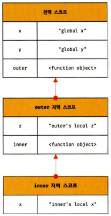

# 모던 자바스크립트 Deep Dive CH13. 스코프

## 목차

- [스코프란](#스코프란)
  - [식별자 결정](#식별자-결정)
- [스코프의 종류](#스코프의-종류)
- [스코프 체인](#스코프-체인)
- [함수 레벨 스코프](#함수-레벨-스코프)
- [렉시컬 스코프](#렉시컬-스코프)


## 스코프란

**스코프**<sup>scope</sup>는 식별자가 유효한 범위를 말한다. 모든 식별자(변수명, 함수명, 클래스명 등)는 **자신이 선언된 위치에 의해** 다른 코드가 식별자 자신을 참조할 수 있는 유효 범위가 결정된다.

### 식별자 결정

```js
var a = 'global';

function foo() {
  var a = 'local';
  console.log(a);
}

foo();

console.log(a);
```

위 예제에서 자바스크립트 엔진은 이름이 같은 두 개의 변수(`a`) 중에서 어떤 변수를 참조해야 할 것인지 결정해야 한다. 이를 **식별자 결정**<sup>identifier resolution</sup>이라 한다. 이때 스코프를 통해 어떤 변수를 참조해야 할 것인지 결정한다. 따라서 스코프를 식별자를 검색하는 규칙이라고도 할 수 있다.

> ⭐ **코드의 문맥과 환경**
>
> 자바스크립트 엔진은 코드를 실행할 때 코드의 문맥<sup>context</sup>를 고려한다. 동일한 코드도 어디서 실행되고 주변에 어떤 코드가 있는지에 따라 다른 결과를 만들어 낸다.
>
> 이때, "어디서 실행되고 주변에 어떤 코드가 있는지"를 렉시컬 환경이라 한다. 코드의 문맥은 렉시컬 환경으로 이뤄지고, 이를 구현한 것을 실행 컨텍스트라 한다. 모든 코드는 실행 컨텍스트에서 평가되고 실행된다.

두 개의 `a` 변수를 살펴보자.

1. `'global'` 값을 가진 `a` 변수
   - 전역 스코프
   - 어디서든 참조 가능
2. `'local'` 값을 가진 `a` 변수
   - `foo` 함수 스코프
   - `foo` 함수 내부에서만 참조 가능

식별자는 유일해야 하므로 변수 이름은 중복될 수 없다. 컴퓨터 파일 시스템의 폴더처럼 프로그래밍 언어에서는 스코프를 통해 식별자인 변수 이름의 충돌을 방지하여 같은 이름의 변수를 사용할 수 있게 한다. 즉, 스코프는 네임스페이스이다.

> ⭐ **`var` 키워드로 선언한 변수의 중복 선언**
>
> **`var` 키워드로 선언된 변수**
>   - 같은 스코프 내 중복 선언 허용
>   - 의도치 않게 변수값이 재할당되는 부작용 발생 가능
> 
> **`let`, `const`로 선언된 변수**
>   - 같은 스코프 내 중복 선언 허용 X

## 스코프의 종류

코드는 전역과 지역으로 구분할 수 있다.

|         -          | 전역<sup>global</sup> |         지역<sup>local</sup>          |
| :----------------: | :-------------------: | :-----------------------------------: |
|        설명        | 코드의 가장 바깥 영역 |            함수 몸체 내부             |
|       스코프       |      전역 스코프      |              지역 스코프              |
|        변수        |       전역 변수       |               지역 변수               |
| 변수가 유효한 범위 | 어디서든지 참조 가능  | 자신의 지역 스코프와 하위 지역 스코프 |

변수는 자신이 선언된 위치(전역/지역)에 의해 스코프가 결정된다.

## 스코프 체인

함수는 중첩(중첩함수, 외부 함수)이 가능하다. 따라서 함수의 지역 스코프도 중첩될 수 있다. 스코프는 함수의 중첩에 의해 계층적 구조를 갖는다. 이때 외부 함수의 지역 스코프를 중첩 함수의 상위 스코프라 한다.

<center>
  
</center>

위 이미지와 같이 모든 스코프는 하나의 계층적 구조로 연결되며, 모든 지역 스코프의 최상위 스코프는 전역 스코프이다. **스코프 체인**<sup>scope chain</sup>은 이와 같이 스코프가 계층적으로 연결된 것을 말한다. 

자바스크립트 엔진이 변수를 참조할 때 스코프 체인을 통해 변수를 참조하는 코드의 스코프부터 시작하여 상위 스코프 방향으로 이동하며 선언된 변수를 검색한다.

> ※ 주의: 상위 스코프에서 유효한 변수는 하위 스코프에서 자유롭게 참조할 수 있지만 하위 스코프에서 유효한 변수를 상위 스코프에서 참조할 수 없다.

## 함수 레벨 스코프

`var` 키워드로 선언된 변수는 오로지 함수의 코드 블록(함수 몸체)만을 지역 스코프로 인정하는데, 이러한 특성을 함수 레벨 스코프라 한다. 

```js
if (1) {
  // 코드 블록 내에서 선언되었지만 함수 밖이므로 전역 변수이다.
  var a = 'global';
}
```

> ⭐ **블록 레벨 스코프**
>
> 함수 몸체뿐만 아니라 모든 코드 블록(`for`, `if`, ...)이 지역 스코프를 만드는 특성
>
> 자바스크립트의 `let`, `const`는 블록 레벨 스코프를 지원한다.

## 렉시컬 스코프

프로그래밍 언어는 동적 스코프와 렉시컬 스코프 방식 중 한 가지 방식으로 함수의 상위 스코프를 결정한다.

* 동적 스코프<sup>dynamic scope</sup>
  - 함수를 어디서 호출했는지에 따라 함수의 상위 스코프를 결정
  - 함수가 호출되는 시점에 동적으로 상위 스코프 결정
* 렉시컬 스코프<sup>lexical scope</sup>/정적 스코프<sup>static scope</sup>
  - 함수를 어디서 정의했는지에 따라 함수의 상위 스코프를 결정
  - 함수 정의가 평가되는 시점에 상위 스코프가 정적으로 결정

자바스크립트를 포함한 대부분의 프로그래밍 언어는 렉시컬 스코프를 따른다. 따라서 함수의 상위 스코프는 언제나 자신이 정의된 스코프다.

함수 정의가 실행되어 생성된 객체는 함수가 호출될 때마다 함수의 상위 스코프를 참조할 필요가 있기 때문에 상위 스코프를 기억한다.

```js
var a = 'hello';

// 전역에서 정의
// 전역 스코프를 상위 스코프로 사용
function fOne() {
  var a = 'world';
  inner();
}

// 전역에서 정의
// 전역 스코프를 상위 스코프로 사용
function fTwo() {
  console.log(a);
}

fOne(); // hello
fTwo(); // hello
```