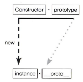
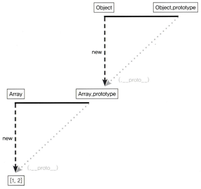

# 모던 자바스크립트 Deep Dive CH19. 프로토타입

## 목차

- [객체지향 프로그래밍](#객체지향-프로그래밍)
- [상속과 프로토타입](#상속과-프로토타입)
- [프로토타입 객체](#프로토타입-객체)
  - [`__proto__` 접근자 프로퍼티](#__proto__-접근자-프로퍼티)
  - [함수 객체의 prototype 프로퍼티](#함수-객체의-prototype-프로퍼티)
- [리터럴 표기법에 의해 생성된 객체](#리터럴-표기법에-의해-생성된-객체)
- [프로토타입의 생성 시점](#프로토타입의-생성-시점)
- [객체 생성 방식과 프로토타입의 결정](#객체-생성-방식과-프로토타입의-결정)
  - [객체 생성 방식](#객체-생성-방식)
- [프로토타입 체인](#프로토타입-체인)
  - [메서드 오버라이드](#메서드-오버라이드)
- [`instanceof` 연산자](#instanceof-연산자)
- [직접 상속](#직접-상속)
  - [`Object.create`](#objectcreate)
- [객체 리터럴 내부 `__proto__`](#객체-리터럴-내부-__proto__)
- [정적 프로퍼티/메서드](#정적-프로퍼티메서드)
- [프로퍼티 존재 확인](#프로퍼티-존재-확인)
  - [`in` 연산자](#in-연산자)
  - [`Object.prototypehasOwnProperty` 메서드](#objectprototypehasownproperty-메서드)
- [프로퍼티 열거](#프로퍼티-열거)
  - [`for...in` 문](#forin-문)
  - [`Object.keys/values/entries` 메서드](#objectkeysvaluesentries-메서드)

## 객체지향 프로그래밍

프로그램을 명령어 또는 함수의 목록으로 보는 전통적인 명령형 프로그래밍의 절차지향적 관점에서 벗어나 여러 개의 독립적 단위, 즉 **객체의 집합으로 프로그램을 표현**하려는 프로그래밍 패러다임을 말한다.

* 객체: 속성을 통해 여러 개의 값을 하나의 단위로 구성한 복합적인 자료구조
* 객체지향 프로그래밍: 독립적인 객체의 집합으로 프로그램을 표현하려는 프로그래밍 패러다임
  - 객체는 상태 데이터와 동작을 하나의 논리적인 단위로 묶은 복합적인 자료구조
    + 상태 데이터: 프로퍼티
    + 동작: 메서드

> ⭐ **추상화**
>
> 다양한 속성 중에서 프로그램에 필요한 속성만 간추려 내어 표현하려는 것

## 상속과 프로토타입

상속은 어떤 객체의 프로퍼티 또는 메서드를 다른 객체가 상속받아 그대로 사용할 수 있는 것을 말하며 객체지향 프로그래밍의 핵심 개념이다.

자바스크립트는 **프로토타입을 기반으로 상속을 구현**해 불필요한 중복을 제거한다. 다시말해, 기존의 코드를 적극적으로 재사용한다.

```js
// 생성자 함수
function Square(num) {
  this.num = num;
}

// 프로토타입에 메서드 추가
// 생성자 함수가 생성한 모든 인스턴스가 getSquare 메서드 공유 가능
// 프로토타입은 Square 생성자 함수의 prototype 프로퍼티에 바인딩
Square.prototype.getSquare = function () {
  return this.num ** 2;
}
```



* 어떤 생성자 함수를 `new` 연산자와 함께 호출
* `Constructor`에서 정의된 내용을 바탕으로 새로운 인스턴스 생성
* `instance`에는 `__proto__` 프로퍼티가 자동으로 부여
* `__proto__`는 `Constructor`의 `prototype` 프로퍼티를 참조

## 프로토타입 객체

프로토타입은 어떤 객체의 상위 객체의 역할을 하는 객체로서 다른 객체에 공유 프로퍼티(메서드 포함)를 제공한다. 모든 객체는 `[[Prototype]]`이라는 내부 슬롯을 가지며 `__proto__` 접근자 프로퍼티를 통해 간접적으로 접근할 수 있다.

### `__proto__` 접근자 프로퍼티

* 접근자 프로퍼티이므로 값(`[[Value]]`) 프로퍼티를 갖지 않고 접근자 함수(`[[Get]]`, `[[Set]]`)로 구성된다.
* 객체가 직접 소유하는 프로퍼티가 아니라 `Object.prototype`의 프로퍼티이므로 상속을 통해 사용된다. 
* 상호 참조에 의해 프로토타입 체인이 생성되는 것을 방지하기 위해 사용한다.
  - 프로토타입 체인은 단방향 링크드 리스트로 구현되어야 한다.
      > 프로퍼티 검색 방향이 한쪽 방향으로만 흘러가야 함
* 코드 내에서 직접 사용하는 것은 권장하지 않는다.
  - 프로토타입의 참조 취득: `Object.getPrototypeOf` 메서드 사용
  - 프로토타입 교체: `Object.setPrototypeOf` 메서드 사용

### 함수 객체의 prototype 프로퍼티

함수 객체만이 소유하는 prototype 프로퍼티는 **생성자 함수가 생성할 인스턴스의 프로토타입**을 가리킨다. 모든 객체가 갖고 있는 `__proto__` 접근자 프로퍼티와 함수 객체만이 갖고 있는 prototype 프로퍼티는 동일한 프로토타입을 가리킨다.

|              구분              |    소유     |        값         |  사용 주체  | 사용 목적                                                          |
| :----------------------------: | :---------: | :---------------: | :---------: | :----------------------------------------------------------------- |
| `__proto__`<br>접근자 프로퍼티 |  모든 객체  | 프로토타입의 참조 |  모든 객체  | 객체가 자신의 프로토타입에 접근 또는 교체하기 위해 사용            |
|    `prototype`<br>프로퍼티     | constructor | 프로토타입의 참조 | 생성자 함수 | 생성자 함수가 자신이 생성할 객체의 프로토타입을 할당하기 위해 사용 |

## 리터럴 표기법에 의해 생성된 객체

프로토타입과 생성자 함수는 단독으로 존재할 수 없고 언제나 쌍으로 존재한다. 리터럴 표기법에 의해 생성된 객체도 프로토타입이 존재하지만, 프로토타입의 constructor 프로퍼티가 가리키는 생성자 함수가 반드시 객체를 생성한 생성자 함수라고 단정할 수는 없다. 

|   리터럴 표기법    | 생성자 함수 |      프로토타입      |
| :----------------: | :---------: | :------------------: |
|    객체 리터럴     |  `Object`   |  `Object.prototype`  |
|    함수 리터럴     | `Function`  | `Function.prototype` |
|    배열 리터럴     |   `Array`   |  `Array.prototype`   |
| 정규 표현식 리터럴 |  `RegExp`   |  `RegExp.prototype`  |

## 프로토타입의 생성 시점

프로토타입과 생성자 함수는 단독으로 존재할 수 없고 언제나 쌍으로 존재하기 때문에 프로토타입은 생성자 함수가 생성되는 시점에 생성된다.

생성자 함수는 아래 두 가지로 구분할 수 있다.

* 사용자 정의 생성자 함수: 사용자가 직접 정의
  - 자신이 평가되어 함수 객체로 생성되는 시점에 프로토타입도 생성
  - 생성된 프로토타입의 프로토타입은 언제나 `Object.prototype`
* 빌트인 생성자 함수: 자바스크립트가 기본 제공 ex. `Object`, `String`, `Number`, `Function`, `Array`, `RegExp`, `Date`, `Promise`
  - 모든 빌트인 생성자 함수는 전역 객체가 생성되는 시점에 생성
  - 객체가 생성되기 이전에 생성자 함수와 프로토타입이 객체화되어 존재
  - 생성자 함수 또는 리터럴 표기법으로 객체 생성시 프로토타입은 생성된 객체의 `[[Prototype]]` 내부 슬롯에 할당

## 객체 생성 방식과 프로토타입의 결정

### 객체 생성 방식

1. 객체 리터럴
2. `Object` 생성자 함수
3. 생성자 함수
4. `Object.create` 메서드
5. 클래스 (ES6)

위 객체 생성 방식들은 추상 연산 `OrdinaryObjectCreate`에 의해 생성된다는 공통점이 있다.

> ⭐ **`OrdinaryObjectCreate`**
>
> ```
> - 필수적으로 자신이 생성할 객체의 프로토타입을 인수로 전달 받음
> - 자신이 생성할 객체에 추가할 프로퍼티 목록을 옵션으로 전달
> ```
>
> 1. 빈 객체 생성 후, 객체에 추가할 프로퍼티 목록이 인수로 전달된 경우 프로퍼티를 객체에 추가
> 2. 전달받은 프로토타입을 자신이 생성한 객체의 `[[Prototype]]` 내부 슬롯에 할당, 생성한 객체 반환

## 프로토타입 체인

자바스크립트는 객체의 프로퍼티(메서드 포함)에 접근하려고 할 때 해당 객체에 접근하려는 프로퍼티가 없다면 `[[Prototype]]` 내부 슬롯의 참조를 따라 자신의 부모 역할을 하는 프로토타입의 프로퍼티를 순차적으로 검색한다. 이를 프로토타입 체인이라 하며, 자바스크립트가 객체지향 프로그래밍의 상속을 구현하는 메커니즘이다.



위 이미지로 알 수 있듯이, `__proto__` 방향을 계속 찾아가면 최종적으로는 `Object.prototype`에 도착하게 된다. 프로토타입 체이닝을 통해 각 프로토타입 메서드를 자신의 것처럼 호출할 수 있으며, 접근 방식은 자신으로부터 가장 가까운 대상부터 먼 대상으로 나아간다.

### 메서드 오버라이드

```js
let Man = function (name) {
  this.name = name;
};
Man.prototype.sayHello = function () {
  return `안녕하세요. ${this.name}입니다.`;
};

let me = new Man('overtae');
me.sayHello = function () {
  return `제 이름은 ${this.name}입니다:)`;
};

console.log(me.sayHello()); // 제 이름은 overtae입니다:)
// 가장 가까운 자신의 프로퍼티를 검색
// 없다면 그다음으로 가까운 대상인 __proto__를 검색

// prototype에 있는 메서드에 접근하기
Man.prototype.name = 'overtae'; // prototype에 프로퍼티 추가
console.log(me.__proto__.sayHello.call(me)); // 안녕하세요. overtae입니다.
```

> ⭐ **`call` 메서드**
>
> `call` 메서드는 `this`로 사용할 객체를 전달하면서 함수를 호출한다.

> ⭐ **오버라이딩과 오버로딩**
>
> **오버라이딩**
> * 상위 클래스가 가지고 있는 메서드를 하위 클래스가 재정의하여 사용하는 방식
>
> **오버로딩**
> * 함수의 이름은 동일하지만 매개변수의 타입 또는 개수가 다른 메서드를 구현하고, 매개변수에 의해 메서드를 구별하여 호출하는 방식
> * 자바스크립트는 지원하지 않지만 `arguments` 객체를 사용해 구현할 수 있다.

## `instanceof` 연산자

```js
객체 instanceof 생성자 함수
```

우변의 생성자 함수의 prototype에 바인딩된 객체가 좌변의 객체의 프로토타입 체인 상에 존재할 경우 `true`, 그렇지 않은 경우 `false`로 평가된다.

## 직접 상속

### `Object.create`

```js
/**
* 지정된 프로토타입 및 프로퍼티를 갖는 새로운 객체를 생성하여 반환한다.
* @param {Object} prototype - 생성할 객처/의 프로토타입으로 지정할 객체
* @param {Object} [propertiesObject] - 생성할 객체의 프로퍼티를 갖는 객체
* ©returns {Object} 지정된 프로토타입 및 프로퍼티를 갖는 새로운 객체
*/
Object.create(prototype[, propertiesObject])
```

`Object.create` 메서드는 명시적으로 프로토타입을 지정하여 새로운 객체를 생성한다. 

* `new` 연산자 없이도 객체 생성 가능
* 프로토타입을 지정하면서 객체 생성 가능
* 객체 리터럴에 의해 생성된 객체도 상속 가능

## 객체 리터럴 내부 `__proto__`

`Object.create` 메서드는 여러 장점이 있지만 두 번째 인자로 프로퍼티를 정의하는 것은 번거로운 일이다. ES6에서는 객체 리터럴 내부에서 `__proto__` 접근자 프로퍼티를 사용해 직접 상속을 구현할 수 있다.

```js
const banana = { amount: 2000 };

const fruits = {
  apple: 3000,
  __proto__: banana
};
```

## 정적 프로퍼티/메서드

생성자 함수로 인스턴스를 생성하지 않아도 참조/호출할 수 있는 프로퍼티/메서드를 말한다.

```js
function Test() {}

// 프로토타입 메서드
Test.prototype.hello = function () {
  console.log('hello');
};

// 프로토타입 메서드는 인스턴스를 생성해야 호출 가능
const test = new Test();
test.hello();

// 정적 메서드
Test.hello = function () {
  console.log('hello');
};

// 정적 메서드는 인스턴스를 생성하지 않아도 호출 가능
Test.hello();
```

## 프로퍼티 존재 확인

### `in` 연산자

```js
/**
* key: 프로퍼티 키를 나타내는 문자열
* object: 객체로 평가되는 표현식
*/
key in object
```

`in` 연산자는 객체 내에 특정 프로퍼티가 존재하는지 여부를 확인한다. ES6에서 도입된 `Reflect.has` 메서드와 동일하게 동작한다.

### `Object.prototypehasOwnProperty` 메서드

```js
person.hasOwnProperty('name')
```

인수로 전달받은 프로퍼티 키가 객체 고유의 프로퍼티 키인 경우 `true`, 아닌 경우(상속받은 프로토타입의 프로퍼티 키인 경우) `false`를 반환한다.

## 프로퍼티 열거

### `for...in` 문

```js
// 객체의 모든 프로퍼티를 순회하며 열거할 때 사용
for (변수선언문 in 객체) { ... }
```

객체의 프로토타입 체인 상에 존재하는 모든 프로토타입의 프로퍼티 중에서 프로퍼티 어트리뷰트 `[[Enumerable]]`의 값이 `true`인 프로퍼티를 순회하며 열거한다.

따라서 `Object.prototype.hasOwnProperty` 메서드를 사용해 객체 자신의 프로퍼티인지 확인하는 처리가 필요하다.

### `Object.keys/values/entries` 메서드

객체 자신의 고유 프로퍼티뿐 아니라 상속받은 프로퍼티도 열거하는 `for...in` 문과 달리 `Object.keys/values/entries` 메서드는 객체 자신의 고유 프로퍼티만 열거한다.

* `Object.keys`: 객체 자신의 열거 가능한 프로퍼티 키를 배열로 반환
* `Object.values`: 객체 자신의 열거 가능한 프로퍼티 값을 배열로 반환
* `Object.entries`: 객체 자신의 열거 가능한 프로퍼티 키와 값의 쌍의 배열을 배열에 담아 반환