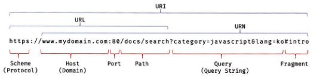

# 모던 자바스크립트 Deep Dive CH21. 빌트인 객체

## 목차

- [자바스크립트 객체의 분류](#자바스크립트-객체의-분류)
- [표준 빌트인 객체](#표준-빌트인-객체)
- [원시값과 래퍼 객체](#원시값과-래퍼-객체)
- [전역 객체](#전역-객체)
  - [특징](#특징)
  - [빌트인 전역 프로퍼티](#빌트인-전역-프로퍼티)
  - [빌트인 전역 함수](#빌트인-전역-함수)

## 자바스크립트 객체의 분류

* **표준 빌트인 객체**<sup>standard built-in objects/native objects/global objects</sup>
  - ECMAScript 사양에 정의된 객체
    > 자바스크립트 실행 환경과 관계없이 언제나 사용 가능
  - 애플리케이션 전역의 공통 기능 제공
  - 전역 객체의 프로퍼티로서 제공
    > 별도의 선언 없이 전역 변수처럼 언제나 참조 가능
* **호스트 객체**<sup>host objects</sup>
  - ECMAScript 사양에 정의되어 있지 않지만 자바스크립트 실행 환경에서 추가로 제공하는 객체
    + 브라우저 환경: DOM, BOM, Canvas, XMLHttpRequest, fetch, requestAnimationFrame, SVG, Web Storage, Web Component, Web Worker와 같은 클라이언트 사이드 Web API 제공
    + Node.js 환경: Node.js 고유의 API 제공
* **사용자 정의 객체**<sup>user-defined objects</sup>
  - 기본 제공되는 객체가 아닌 사용자가 직접 정의한 객체

## 표준 빌트인 객체

자바스크립트는 40여 개의 표준 빌트인 객체를 제공하고, **`Math, Reflect, JSON`**을 제외한 표준 빌트인 객체는 모두 생성자 함수 객체다.

| -                                        | 프로토타입 메서드 제공 | 정적 메서드 제공 |
| :--------------------------------------- | :--------------------: | :--------------: |
| 생성자 함수 객체인 표준 빌트인 객체      |           Ｏ           |        Ｏ        |
| 생성자 함수 객체가 아닌 표준 빌트인 객체 |           Ｘ           |        Ｏ        |

표준 빌트인 객체의 prototype 프로퍼티에 바인딩된 객체는 다양한 기능의 빌트인 프로토타입 메서드를 제공하고, 표준 빌트인 객체는 인스턴스 없이도 호출 가능한 빌트인 정적 메서드를 제공한다. 

```js
// Number 생성자 함수에 의한 Number 객체 생성
// myNumber 객체의 프로토타입은 Number.prototype
const myNumber = new Number(5.2); // Number {5.2}

// toFixed: Number.prototype의 프로토타입 메서드
console.log(myNumber.toFixed()); // 5, 소수점 자리를 반올림해 문자열로 반환

// isInteger: Number의 정적 메서드
console.log(Number.isInteger(123)); // true, 인수가 정수인지 검사하여 불리언으로 반환
```

## 원시값과 래퍼 객체

래퍼 객체는 문자열, 숫자, 불리언 값에 대해 객체처럼 접근하면 생성되는 임시 객체를 말한다. — [참고](../week02/ch11-%EC%9B%90%EC%8B%9C%EA%B0%92%EA%B3%BC-%EA%B0%9D%EC%B2%B4%EC%9D%98-%EB%B9%84%EA%B5%90.md/#래퍼-오브젝트)

ES6에서 도입된 심벌도 래퍼 객체를 생성한다. 즉 문자열, 숫자, 불리언, 심벌은 암묵적으로 생성되는 래퍼 객체에 의해 마치 객체처럼 사용할 수 있고, 표준 빌트인 객체인 String, Number, Boolean, Symbol의 프로토타입 메서드 또는 프로퍼티를 참조할 수 있다. 따라서 String, Number, Boolean 생성자 함수를 new 연산자와 함께 호출하여 인스턴스를 생성하는 것을 권장하지 않는다. (Symbol은 생성자 함수가 아니다.)

## 전역 객체

전역 객체는 코드가 실행되기 이전 단계에 자바스크립트 엔진에 의해 어떤 객체보다도 먼저 생성되는 특수한 객체이며, 어떤 객체에도 속하지 않은 최상위 객체를 말한다. 전역 객체는 자바스크립트 환경에 따라 지칭하는 이름이 다르다.

* 브라우저 환경: window(또는 self, this, frames)
* Node.js 환경: global

> ⭐ **globalThis**
>
> ES11에서 도입된 `globalThis`는 브라우저 환경과 Node.js 환경에서 전역 객체를 가리키던 식별자를 통일한 식별자이다. ECMAScript 표준 사양을 준수하는 모든 환경에서 사용할 수 있다.

### 특징

* 표준 빌트인 객체와 환경에 따른 호스트 객체, var 키워드로 선언한 전역 변수와 전역 함수를 프로퍼티로 갖음
  > `let`, `const`를 사용한 전역 변수는 전역 렉시컬 환경의 선언적 환경 레코드 내에 존재
* 생성자 함수가 제공되지 않아 개발자가 의도적으로 생성 불가
* 프로퍼티 참조시 window(또는 global)를 생략 가능
* 브라우저 환경의 모든 자바스크립트 코드는 하나의 전역 객체 window를 공유

### 빌트인 전역 프로퍼티

* **Infinity**: 무한대를 나타내는 숫자값 Infinity를 갖는다.
* **NaN**: Not-a-Number를 나타내는 숫자값 NaN을 갖는다. Number.NaN 프로퍼티와 같다.
* **undefined**: 원시 타입 undefined를 값으로 갖는다.

### 빌트인 전역 함수

* **eval**
  ```js
  /**
  * 주어진 문자열 코드를 런타임에 평가 또는 실행한다.
  * @param {string} code - 코드를 나타내는 문자열
  * @returns {*} 문자열 코드를 평가/실행한 결과값
  */
  eval(code)
  ```
  - eval 함수는 기존의 스코프를 런타임에 동적으로 수정한다.
    > 단, strict mode에서는 기존의 스코프를 수정하지 않고 eval 함수 자신의 자체적인 스코프를 생성한다.
  - eval 함수의 사용은 금지해야 한다.
    1. eval 함수를 통해 사용자로부터 입력받은 콘텐츠를 실행하는 것은 보안에 매우 취약함
    2. eval 함수를 통해 실행되는 코드는 최적화가 수행되지 않아 일반적인 실행에 비해 처리 속도가 느림
* **isFinite**
  ```js
  /**
  * 전달받은 인수가 유한수인지 확인하고 그 결과를 반환한다.
  * @param {number} testvalue - 검사 대상 값
  * @returns {boolean} 유한수 여부 확인 결과
  */
  isFinite(testvalue)
  ```
* **isNaN**
  ```js
  /**
  * 주어진 숫자가 NaN인지 확인하고 그 결과를 반환한다.
  * @param {number} testValue - 검사 대상 값
  * @returns {boolean} NaN 여부 확인 결과
  */
  isNaN(testValue)
  ```
* **parseFloat**
  ```js
  /**
  * 전달받은 문자열 인수를 실수로 해석하여 반환한다.
  * @param {string} string - 변환 대상 값
  * @returns {number} 변환 결과
  */
  parseFloat(string)
  ```
* **parseInt**
  ```js
  /**
  * 전달받은 문자열 인수를 정수로 해석하여 반환한다.
  * @param {string} string - 변환 대상 값
  * @param {number} [radix] - 진법을 나타내는 기수(2 ~ 36, 기본값 10)
  * @returns {number} 변환 결과
  */
  parselnt(string, radix);
  ```
* **encodeURI/decodeURI**
  > **URI**<sup>Uniform Resource Identifier</sup>
  > 
  ```js
  /**
  * 완전한 URI를 문자열로 전달받아 이스케이프 처리를 위해 인코딩한다.
  * @param {string} uri - 완전한 URI
  * @returns {string} 인코딩된 URI
  */
  encodeURI(uri)

  /**
  * 인코딩된 URI를 전달받아 이스케이프 처리 이전으로 디코딩한다.
  * @param {string} encodedURI - 인코딩된 URI
  * @returns {string} 디코딩된 URI
  */
  decodeURI(encodedURI)
  ```
* **encodeURIComponent/decodeURIComponent**
  ```js
  /**
  * URI의 구성요소를 전달받아 이스케이프 처리를 위해 인코딩한다.
  * @param {string} uriComponent — URI의 구성요소
  * @returns {string} 인코딩된 URI의 구성요소
  */
  encodeURIComponent(uriComponent)

  /**
  * 인코딩된 URI의 구성요소를 전달받아 이스케이프 처리 이전으로 디코딩한다.
  * @param {string} encodedURIComponent - 인코딩된 URI의 구성요소
  * @returns {string} 디코딩된 URI의 구성요소
  */
  decodeURIComponent( encodedURIComponent)
  ```
