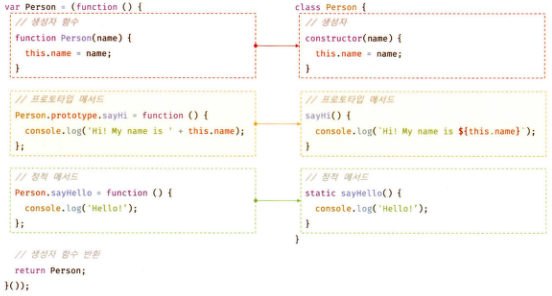

# 모던 자바스크립트 Deep Dive CH25. 클래스

## 목차

  - [클래스 기반 언어와 프로토타입 기반 언어](#클래스-기반-언어와-프로토타입-기반-언어)
    - [ES6 클래스](#es6-클래스)
  - [클래스 정의](#클래스-정의)
    - [생성자 함수 vs. 클래스](#생성자-함수-vs-클래스)
    - [클래스와 인스턴스](#클래스와-인스턴스)
  - [클래스 호이스팅](#클래스-호이스팅)
  - [인스턴스 생성](#인스턴스-생성)
    - [1. 클래스 선언문](#1-클래스-선언문)
    - [2. 클래스 표현식](#2-클래스-표현식)
  - [메서드](#메서드)
    - [1. constructor](#1-constructor)
    - [2. 프로토타입 메서드](#2-프로토타입-메서드)
    - [3. 정적 메서드](#3-정적-메서드)
    - [4. 정적 메서드 vs. 프로토타입 메서드](#4-정적-메서드-vs-프로토타입-메서드)
    - [5. 클래스에서 정의한 메서드 특징](#5-클래스에서-정의한-메서드-특징)
  - [인스턴스 생성 과정](#인스턴스-생성-과정)
    - [1. 인스턴스 생성과 this 바인딩](#1-인스턴스-생성과-this-바인딩)
    - [2. 인스턴스 초기화](#2-인스턴스-초기화)
    - [3. 인스턴스 반환](#3-인스턴스-반환)
  - [프로퍼티](#프로퍼티)
    - [인스턴스 프로퍼티](#인스턴스-프로퍼티)
    - [접근자 프로퍼티](#접근자-프로퍼티)
    - [클래스 필드 정의 제안](#클래스-필드-정의-제안)
    - [private 필드 정의 제안](#private-필드-정의-제안)
    - [static 필드 정의 제안](#static-필드-정의-제안)
  - [상속](#상속)
    - [extends 키워드](#extends-키워드)
    - [동적 상속](#동적-상속)
    - [표준 빌트인 생성자 함수 확장](#표준-빌트인-생성자-함수-확장)
    - [서브클래스의 constructor](#서브클래스의-constructor)
    - [super 키워드](#super-키워드)
      - [1. super 호출](#1-super-호출)
      - [2. super 참조](#2-super-참조)
    - [상속 클래스의 인스턴스 생성 과정](#상속-클래스의-인스턴스-생성-과정)
      - [1. 서브클래스의 super 호출](#1-서브클래스의-super-호출)
      - [2. 수퍼클래스의 인스턴스 생성과 this 바인딩](#2-수퍼클래스의-인스턴스-생성과-this-바인딩)
      - [3. 수퍼클래스의 인스턴스 초기화](#3-수퍼클래스의-인스턴스-초기화)
      - [4. 서브클래스 constructor로의 복귀와 this 바인딩](#4-서브클래스-constructor로의-복귀와-this-바인딩)
      - [5. 서브클래스의 인스턴스 초기화](#5-서브클래스의-인스턴스-초기화)
      - [6. 인스턴스 반환](#6-인스턴스-반환)

## 클래스 기반 언어와 프로토타입 기반 언어

자바스크립트는 프로토타입 기반 객체지향 언어로, 클래스가 필요없는 객체지향 프로그래밍 언어다. 따라서 ES5에서는 클래스 없이도 생성자 함수와 프로토타입을 통해 객체지향 언어의 상속을 구현할 수 있다. 

### ES6 클래스

클래스는 ES6에서 도입되었다. 기존의 프로토타입 기반 객체지향 모델을 페지하고 클래스 기반 객체지향 모델을 제공하는 것이 아니라, 클래스는 함수이며 기존 프로토타입 기반 패턴을 클래스 기반 패턴처럼 사용할 수 있도록 하는 문법적 설탕<sup>Syntactic sugar[^syntactic-sugar]</sup>이라 볼 수 있다. 

[^syntactic-sugar]: 읽는 사람 또는 작성하는 사람이 직관적으로 쉽게 코드를 읽을 수 있도록 디자인 된 문법

클래스는 생성자 함수와 매우 유사하게 동작하지만 몇 가지 차이가 있다. 따라서 문법적 설탕보다는 새로운 객체 생성 메커니즘으로 보는 것이 더 합당하다.

|          클래스           |        차이점         |                       생성자 함수                        |
| :-----------------------: | :-------------------: | :------------------------------------------------------: |
|         에러 발생         | new 연산자 없이 호출  |                    일반 함수로서 호출                    |
|           제공            | extends, super 키워드 |                      지원하지 않음                       |
| 발생하지 않는 것처럼 동작 |       호이스팅        | 함수 선언문: 함수 호이스팅<br>함수 표현식: 변수 호이스팅 |
|  암묵적 지정, 해제 불가   |      strict mode      |                      지정되지 않음                       |

또한 클래스의 constructor, 프로토타입 메서드, 정적 메서드는 모두 열거되지 않는다. (프로퍼티 어트리뷰트 `[[Enumerable]]` 값이 false)

## 클래스 정의

클래스 이름은 일반적으로 생성자 함수와 같이 *파스칼 케이스*를 사용한다.

```js
// 클래스 선언문
class Man {}

// 익명 클래스 표현식
const Man = class {};

// 기명 클래스 표현식
const Man = class HelloClass {};
```

클래스는 함수이기 때문에 표현식으로 정의가 가능하고 값처럼 사용할 수 있는 일급 객체다. 클래스는 일급 객체로서 아래와 같은 특징을 갖는다.

* 무명의 리터럴로 생성 가능 (런타임에 생성 가능)
* 변수나 자료구조(객체, 배열 등)에 저장 가능
* 함수의 매개변수로 전달 가능
* 함수의 반환값으로 사용 가능

### 생성자 함수 vs. 클래스



### 클래스와 인스턴스

* 클래스: 어떤 사물의 공통 속성을 모아 정의한 추상적 개념
* 인스턴스: 클래스의 속성을 지니는 구체적인 사례

## 클래스 호이스팅

클래스는 함수로 평가된다. 즉, 클래스 선언문으로 정의한 클래스는 함수 선언문과 같이 소스코드 평가 과정(런타임 이전)에 먼저 평가되어 함수 객체와 프로토타입을 생성한다. 이때 생성된 함수 객체는 생성자 함수로서 호출할 수 있는 constructor 함수다. 

클래스는 let, const 키워드로 선언한 변수처럼 호이스팅되어, 클래스 선언문 이전에 일시적 사각지대에 빠지게 된다. 따라서 호이스팅이 발생하지 않는 것처럼 동작한다.

> ⭐ **호이스팅되는 식별자**
>
> `var, let, const, function, function*, class` 키워드를 사용하여 선언된 모든 식별자

## 인스턴스 생성

클래스는 생성자 함수로, new 연산자와 함께 호출되어 인스턴스를 생성한다.

### 1. 클래스 선언문

```js
class Man {}

// 인스턴스 생성
const gildong = new Man();
```

### 2. 클래스 표현식

```js
const Man = class HelloClass {};

// 클래스를 가리키는 식별자를 사용해야 함
const gildong = new Man();

// 기명 클래스 표현식의 클래스 이름은 클래스 몸체 내부에서만 유효
const chulsu = new HelloClass(); // ReferenceError
```

## 메서드

클래스 몸체에는 0개 이상의 메서드만 정의할 수 있다. 정의 가능한 메서드는 아래 세 가지가 있다.

1. constructor(생성자)
2. 프로토타입 메서드
3. 정적 메서드

### 1. constructor

인스턴스를 생성하고 초기화하기 위한 특수한 메서드로 이름을 변경할 수 없다. 

> 💭 특수한 메서드?
> 
> — *constructor는 메서드로 해석되는 것이 아니라, 클래스 정의가 평가되면 constructor의 기술된 동작을 하는 함수 객체가 생성된다.*

```js
class Man {
  // 생성자, constructor
  constructor(age) {
    // 인스턴스 생성 및 초기화
    this.age = age;
  }
}
```

* constructor는 클래스 내에 최대 한 개만 존재할 수 있다.
  - 생략 가능 (암묵적으로 빈 constructor 정의)
    ```js
    class Man {
      constructor() {}
    }
    ```
* 프로퍼티가 추가되어 초기화된 인스턴스를 생성하려면 constructor 내부에서 this에 인스턴스 프로퍼티를 추가한다.
* constructor에 매개변수를 선언하고 인스턴스를 생성할 때 초기값을 전달하여 클래스 외부에서 인스턴스 프로퍼티의 초기값을 전달할 수도 있다.
  ```js
  class Man {
    constructor(name) {
      this.name = name;
    }
  }

  const gildong = new Man('홍길동');
  ```
* constructor는 별도의 반환문을 갖지 않아야 한다.
  > 다른 객체를 명시적으로 반환하면 인스턴스가 반환되지 못하고 명시한 객체가 반환된다. 이때, 원시값 반환은 무시된다. (생성자 함수와 동일)

### 2. 프로토타입 메서드

클래스 몸체에서 정의한 메서드는 생성자 함수에 의한 객체 생성 방식과는 다르게 클래스의 prototype 프로퍼티에 메서드를 추가하지 않아도 기본적으로 프로토타입 메서드가 된다.

> ⭐ **생성자 함수에 의한 객체 생성 방식**
>
> ```js
> function Man(name) {
>   this.name
> }
> 
> // 프로토타입 메서드: 명시적으로 추가
> Man.prototype.introduce = function () {
>   return `안녕하세요. ${this.name}입니다.`;
> }
> ```

```js
class Man(name) {
  constructor(name) {
    this.name = name;
  }

  // 프로토타입 메서드
  introduce() {
    return `안녕하세요. ${this.name}입니다.`;
  }
}
```

### 3. 정적 메서드

> 💭 정적 메서드?
> 
> — *인스턴스를 생성하지 않아도 호출할 수 있는 메서드*

정적 메서드를 생성하려면 생성자 함수의 경우 명시적으로 생성자 함수에 정적 메서드를 추가해야 하지만 클래스에서는 메서드에 static 키워드를 붙여주면 된다.

```js
class Man {
  // 정적 메서드(클래스 메서드)
  static run() {
    console.log('달리는 중');
  }
}
```

정적 메서드는 인스턴스로는 호출할 수 없고, 클래스로 호출해야한다.

### 4. 정적 메서드 vs. 프로토타입 메서드

1. 정적 메서드와 프로토타입 메서드는 자신이 속해 있는 프로토타입 체인이 다르다.
2. 정적 메서드는 클래스로 호출, 프로토타입 메서드는 인스턴스로 호출한다.
3. 정적 메서드는 인스턴스 프로퍼티를 참조할 수 없지만 프로토타입 메서드는 가능하다.

클래스나 생성자 함수를 사용해 정적 메서드를 모아 놓으면 이름 충돌 가능성을 줄여 주고 관련 함수들을 구조화할 수 있는 효과가 있다. 따라서 정적 메서드는 애플리케이션 전역에서 사용할 유틸리티 함수를 전역 함수로 정의하지 않고 메서드로 구조화할 때 유용하다.

### 5. 클래스에서 정의한 메서드 특징

1. 메서드 축약 표현 사용(`function` 키워드 생략)
2. 클래스에 메서드 정의 시 콤마(`,`) 불필요
3. 암묵적 strict mode
4. `for...in`, `Object.keys` 메서드 등으로 열거 불가능(프로퍼티 열거 불가능)
5. new 연산자와 함께 호출 불가능(non-constructor)

## 인스턴스 생성 과정

### 1. 인스턴스 생성과 this 바인딩

new 연산자와 함께 클래스를 호출하면,

* 암묵적으로 빈 객체가 생성되고,
* 클래스가 생성한 인스턴스의 프로토타입으로 클래스의 prototype 프로퍼티가 가리키는 객체가 설정되고,
* 생성된 빈 객체(인스턴스)는 this에 바인딩된다.

### 2. 인스턴스 초기화

constructor의 내부 코드가 실행되어 this에 바인딩되어 있는 인스턴스를 초기화한다. constructor가 생략된 경우 이 과정이 생략된다.

### 3. 인스턴스 반환

완성된 인스턴스가 바인딩된 this가 암묵적으로 반환된다.

## 프로퍼티

### 인스턴스 프로퍼티

인스턴스 프로퍼티는 constructor 내부에서 정의해야 한다. ES6의 클래스는 접근 제한자를 지원하지 않으므로 인스턴스 프로퍼티는 항상 public이다.

```js
class Man {
  constructor(age) {
    // 인스턴스 프로퍼티
    this.age = age;
  }
}
```

### 접근자 프로퍼티

접근자 프로퍼티는 자체적으로는 값을 갖지 않고 다른 데이터 프로퍼티의 값을 읽거나 저장할 때 사용하는 접근자 함수로 구성된 프로퍼티다.

```js
class Man {
  constructor(name, age) {
    this.name = name;
    this.age = age;
  }

  // 접근자 함수로 구성된 접근자 프로퍼티
  // getter
  get info() {
    return `이름: ${this.name}, 나이: ${this.age}`;
  }
  // setter
  set info(data) {
    [this.name, this.age] = data.split(' ');
  }
}

const gildong = new Man('홍길동', 20);

gildong.info = '홍길동 25'
console.log(gildong.info)
```

<table>
  <tr>
    <td>getter</td>
    <td>setter</td>
  </tr>
  <tr>
    <td>호출 X, 프로퍼티처럼 참조</td>
    <td>호출 X, 프로퍼티처럼 값 할당</td>
  </tr>
  <tr>
    <td>반드시 무언가를 반환</td>
    <td>반드시 매개변수가 있어야 함<br>(단 하나의 매개변수만 선언 가능)</td>
  </tr>
</table>

### 클래스 필드 정의 제안

> 💭 클래스 필드?
> 
> — *클래스 기반 객체지향 언어에서 클래스가 생성할 인스턴스의 프로퍼티를 가리키는 용어*

자바스크립트 클래스 몸체에는 메서드만 선언 가능하지만, 최신 브라우저(Chrome 72 이상)와 최신 Node.js(버전 12 이상)에서는 클래스 필드를 클래스 몸체에 정의할 수 있다.

```js
class Man {
  // 클래스 필드 정의
  name = '홍길동';
}
```

이는 새로운 표준 사양인 *"Class field declarations"*가 TC39 프로세스의 stage3에 제안되어 있지만 ECMAScript의 정식 표준 사양으로 승급되지 않아 표준 사양으로 승급이 확실시되는 이 제안을 선제적으로 미리 구현해 놓았기 때문이다. 

> ⭐ **TC39 프로세스**
>
> TC39 프로세스는 ECMAScript에 새로운 표준 사양을 추가하기 위해 공식적으로 명문화해 놓은 과정을 말한다. 0단계부터 4단계까지 있고, 승급 조건을 충족시킨 제안은 TC39의 동의를 통해 다음 단계로 승급된다.
> 
> > 💭 **Technical Committee 39, TC39?**
> > 
> > — *ECMA 인터내셔널은 ECMAScript 이외에도 다양한 기술의 사양을 관리하고, 관리하는 주체인 기술 위원회도 여럿 존재한다. 그 중 ECMA-262 사양(ECMAScript)의 관리를 담당하는 위원회가 TC39다.*

* 클래스 몸체에서 클래스 필드를 정의하는 경우 this에 클래스 필드를 바인딩해서는 안 된다.
  - *this는 클래스의 constructor와 메서드 내에서만 유효하다.*
* 클래스 필드를 참조하는 경우 자바스크립트에서는 this를 반드시 사용해야 한다.
* 클래스 필드에 초기값을 할당하지 않으면 undefined를 갖는다.
* 인스턴스를 생성할 때 외부의 초기값으로 클래스 필드를 초기화해야 할 필요가 있다면 constructor에서 초기화해야 한다.
  - *인스턴스를 생성할 때 클래스 필드를 초기화할 필요가 있다면 constructor 밖에서 클래스 필드를 정의할 필요가 없다.*
* 함수는 일급 객체이므로 함수를 클래스 필드에 할당할 수 있다.
  - *클래스 필드를 통해 메서드를 정의할 수도 있다. 이는 인스턴스 메서드가 되기 때문에 권장하지 않는다.*

인스턴스를 생성할 때 외부 초기값으로 클래스 필드를 초기화할 필요가 있다면 constructor에서 인스턴스 프로퍼티를 정의하는 기존 방식을 사용하고, 반대의 경우 기존 방식과 클래스 필드 정의 제안 모두 사용할 수 있다.

### private 필드 정의 제안

자바스크립트는 캡슐화를 완전하게 지원하지 않는다. ES6 클래스도 접근 제한자를 지원하지 않기 때문에 인스턴스 프로퍼티는 언제나 public이다.

TC39 프로세스의 stage 3에 private 필드를 정의할 수 있는 새로운 표준 사양이 제안되어 있다. 따라서 이 제안도 최신 브라우저와 최신 Node.js에는 구형되어 있다.

private 필드는 반드시 클래스 몸체에 정의해야 하며 constructor에 정의하면 에러가 발생한다.

```js
class Man {
  // private 필드 정의: 선두에 #을 붙여야 한다.
  #name = '길동';

  constructor(name) {
    // private 필드 참조: 선두에 #을 붙여야 한다.
    this.#name = name;
  }
}

const gildong = new Man('홍길동');
gildong.#name; // 외부에서 참조 불가능
```

| 접근 가능성                 | public | private |
| --------------------------- | ------ | ------- |
| 클래스 내부                 | O      | O       |
| 자식 클래스 내부            | O      | X       |
| 클래스 인스턴스를 통한 접근 | O      | X       |

클래스 외부에서 private 필드에 직접 접근할 수 있는 방법은 없지만 접근자 프로퍼티를 통해 간접적으로는 가능하다.

### static 필드 정의 제안

클래스에서 정적 메서드는 정의할 수 있지만 정적 필드는 할 수 없었다.

TC39 프로세스의 stage3에 static public 필드, static private필드/메서드를 정의할 수 있는 새로운 표준 사양 *"Static class features"*가 제안되어 있다. 이 중 static public/private 필드는 최신 브라우저와 최신 Node.js에 구현되어 있다.

```js
class Calculator {
  // static public 필드 정의
  static E = 2.71;

  // static private 필드 정의
  static #myNum = 10;

  // static 메서드
  static increase() {
    return **Calculator.#myNum;
  }
}
```

## 상속

> ⭐ **프로토타입 기반 상속 vs. 상속에 의한 클래스 확장**
>
> * 프로토타입 기반 상속: 프로토타입 체인을 통해 다른 객체의 자산을 상속받음
> * 상속에 의한 클래스 확장: 기존 클래스를 상속받아 새로운 클래스를 확장하여 정의하는 것

클래스와 생성자 함수는 매우 유사하지만, 클래스는 상속을 통해 기존 클래스를 확장할 수 있는 문법(extends 키워드)이 기본적으로 제공되는 반면 생성자 함수는 그렇지 않다.

### extends 키워드

상속을 통해 클래스를 확장하려면 extends 키워드를 사용하여 상속받을 클래스를 정의한다. extends 키워드는 수퍼클래스와 서브클래스 간의 상속 관계를 설정하는 역할을 한다. 클래스도 프로토타입을 통해 상속 관계를 구현한다.

수퍼클래스와 서브클래스는 인스턴스뿐만 아니라 클래스 간의 프로토타입 체인도 생성해 프로토타입 메서드와 정적 메서드 모두 상속이 가능하다.

```js
// 수퍼/베이스/부모 클래스: 서브클래스에게 상속된 클래스
class Parent {}

// 서브/파생/자식 클래스: 상속을 통해 확장된 클래스
class Child extends Parent {}
```

### 동적 상속

extends 키워드는 생성자 함수를 상속받아 클래스를 확장할 수도 있다. 그러나 extends 키워드 앞에는 반드시 클래스가 와야 한다.

extends 키워드 다음에는 `[[Construct]]` 내부 메서드를 갖는 함수 객체로 평가될 수 있는 모든 표현식을 사용할 수 있어 동적으로 상속받을 대상을 결정할 수 있다.

```js
function Mother() {}
class Father {}

let state = true;

// 조건에 따라 동적으로 상속 대상을 결정하는 서브클래스
class Child extends (state ? Mother : Father) {}
```

### 표준 빌트인 생성자 함수 확장

extends 키워드 다음에는 `[[Construct]]` 내부 메서드를 갖는 함수 객체로 평가될 수 있는 모든 표현식을 사용할 수 있기 때문에 `[[Construct]]` 내부 메서드를 갖는 String, Number, Array 같은 표준 빌트인 객체도 확장할 수 있다.

```js
// Array 생성자 함수를 상속받아 확장한 MyArray
class MyArray extends Array {
  // 중복된 배열 요소를 저/거하고 반환한다: [1, 1, 2, 3] => [1, 2, 3]
  uniq() {
    return this.filter((v, it self) => self.indexOf(v) === i);
  }

  // 모든 배열 요소의 평균을 구한다: [1, 2, 3] => 2
  average() {
    return this.reduce((pre, cur) => pre + cur, 0) / this.length;
  }
}
```

만약 새로운 배열을 반환하는 메서드가 MyArray 클래스의 인스턴스를 반환하지 않고 Array의 인스턴스를 반환하면 MyArray 클래스의 메서드와 메서드 체이닝(메서드를 연이어 호출하는 것)이 불가능하다.

Array가 생성한 인스턴스를 반환하게 하려면 Symbol.species를 사용하여 정적 접근자 프로퍼티를 추가하면 된다.

```js
class MyArray extends Array {
  // 모든 메서드가 Array 타입의 인스턴스를 반환
  static get [Symbol.species]() { return Array; }
}
```

### 서브클래스의 constructor

서브클래스에서 constructor를 생략할 경우 아래와 같은 constructor가 암묵적으로 정의된다.

```js
// args: new 연산자와 함께 클래스를 호출할 때 전달한 인수의 리스트
// super(): 수퍼클래스의 constructor를 호출하여 인스턴스 생성
constructor(...args) { super(...args); }
```

### super 키워드

super 키워드는 함수처럼 호출할 수도 있고 식별자처럼 참조할 수도 있다.

* super 호출: 수퍼클래스의 constructor를 호출
* super 참조: 수퍼클래스의 메서드 호출 가능

#### 1. super 호출

수퍼클래스의 constructor를 호출한다.

> ⭐ **서브클래스에서 constructor를 생략할 수 있는 경우**
> 
> 수퍼클래스의 constructor 내부에서 추가한 프로퍼티를 그대로 갖는 인스턴스를 생성하는 경우 서브클래스의 constructor를 생략할 수 있다. 그렇지 않은 경우, 수퍼클래스의 constructor에 전달할 필요가 있는 인수는 서브클래스의 constructor에서 호출하는 super를 통해 전달한다.
> 
> ```js
> class Parent {
>   constructor(x, y) {
>     this.x = x;
>     this.y = y;
>   }
> }
> 
> class Child extends Parent {
>   constructor(x, y, z) {
>     super(x, y); // 인수 전달
>     this.z = z;
>   }  
> }
> ```

super를 호출할 때 아래와 같은 점들을 주의해야 한다.

1. 서브클래스에서 constructor를 생략하지 않는 경우 서브클래스의 constructor에서는 반드시 super를 호출해야 한다.
2. 서브클래스의 constructor에서 super를 호출하기 전에는 this를 참조할 수 없다.
3. super는 반드시 서브클래스의 constructor에서만 호출한다. 서브클래스가 아닌 클래스의 constructor나 함수에서 super를 호출하면 에러가 발생한다.

#### 2. super 참조

메서드 내에서 super를 참조하면 수퍼클래스의 메서드를 호출할 수 있다.

```js
class Parent {
  constructor(x, y) {
    this.x = x;
    this.y = y;
  }

  sum() {
    return x + y;
  }
}

class Child extends Parent {
  constructor(x, y, z) {
    super(x, y);
    this.z = z;
  }

  sum() {
    // super.sum(): 수퍼클래스의 프로토타입 메서드를 가리킴
    return super.sum() + z;
  }
}
```

super 참조는 객체 리터럴에서 ES6의 메서드 축약 표현으로 정의된 함수라면 사용할 수 있다.

```js
const parent = {
  x: 10,
  y: 20,
  sum() {
    return this.x + this.y;
  }
};

const child = {
  __proto__: parent,
  z: 30,
  // ES6 메서드 축약 표현으로 정의한 메서드, [[HomeObject]]를 가짐
  sum() {
    return super.sum() + this.z;
  }
};

console.log(child.sum()); // 60
```

### 상속 클래스의 인스턴스 생성 과정

#### 1. 서브클래스의 super 호출

자바스크립트 엔진은 클래스를 평가할 때 수퍼클래스와 서브클래스를 구분하기 위해 `"base"` 또는 `"derived"`를 값으로 갖는 내부 슬롯 `[[ConstructorKind]]`를 갖는다. 이를 통해 new 연산자와 함께 호출되었을 때의 동작이 구분된다.

* `"base"`: 다른 클래스를 상속받지 않는 클래스, 생성자 함수
  > 💭 **new 연산자와 함께 호출되었을 때**
  > 
  > — *암묵적으로 빈 객체(인스턴스)를 생성하고 this에 바인딩한다.*
* `"derived"`: 다른 클래스를 상속받는 서브클래스
  > 💭 **new 연산자와 함께 호출되었을 때**
  > 
  > — *자신이 직접 인스턴스를 생성하지 않고 수퍼클래스에서 인스턴스 생성을 위임한다. 그렇기 때문에 서브클래스의 constructor에서 반드시 super를 호출해야 한다.*

#### 2. 수퍼클래스의 인스턴스 생성과 this 바인딩

수퍼클래스의 constructor 내부의 코드가 실행되기 전에 암묵적으로 빈 객체(인스턴스)를 생성한다. 그리고 인스턴스는 this에 바인딩된다.

이때, new 연산자와 함께 호출된 함수를 가리키는 `new.target`은 서브클래스를 가리킨다. 따라서 인스턴스는 `new.target`이 가리키는 서브클래스가 생성한 것으로 처리된다. 

#### 3. 수퍼클래스의 인스턴스 초기화

수퍼클래스의 constructor가 실행되어 this에 바인딩되어 있는 인스턴스를 초기화한다.

#### 4. 서브클래스 constructor로의 복귀와 this 바인딩

super의 호출이 종료되고, 제어 흐름이 서브클래스 constructor로 돌아온다. 이때 서브클래스는 별도의 인스턴스를 생성하지 않고 super가 반환한 인스턴스를 this에 바인딩하여 그대로 사용한다. 즉, super가 호출되지 않으면 인스턴스가 생성되지 않고, this 바인딩도 할 수 없다.

#### 5. 서브클래스의 인스턴스 초기화

super 호출 이후, 서브클래스의 constructor에 기술되어 있는 인스턴스 초기화가 실행된다.

#### 6. 인스턴스 반환

클래스의 모든 처리가 끝나면 완성된 인스턴스가 바인딩된 this가 암묵적으로 반환된다.