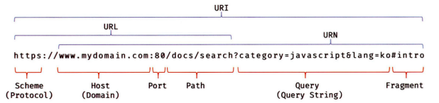
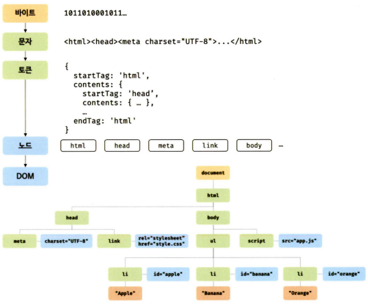

# 모던 자바스크립트 Deep Dive CH38. 브라우저 렌더링 과정

## 목차

- [브라우저 렌더링 과정](#브라우저-렌더링-과정)
  - [파싱과 렌더링](#파싱과-렌더링)
- [요청과 응답](#요청과-응답)
- [HTTP 1.1과 HTTP 2.0](#http-11과-http-20)
- [HTML 파싱과 DOM 생성](#html-파싱과-dom-생성)
- [CSS 파싱과 CSSOM 생성](#css-파싱과-cssom-생성)
- [렌더 트리 생성](#렌더-트리-생성)
- [리렌더링](#리렌더링)
- [자바스크립트 파싱과 실행](#자바스크립트-파싱과-실행)
- [리플로우와 리페인트](#리플로우와-리페인트)
- [자바스크립트 파싱에 의한 HTML 파싱 중단](#자바스크립트-파싱에-의한-html-파싱-중단)
- [script 태그의 async/defer 어트리뷰트](#script-태그의-asyncdefer-어트리뷰트)
  - [async 어트리뷰트](#async-어트리뷰트)
  - [defer 어트리뷰트](#defer-어트리뷰트)

## 브라우저 렌더링 과정

대부분의 프로그래밍 언어는 운영체제나 가상 머신 위에서 실행되지만 웹 애플리케이션의 클라이언트 사이드 자바스크립트는 브라우저에서 HTML, CSS와 함께 실행된다. 브라우저는 아래와 같은 과정을 거쳐 렌더링을 수행한다.

1. 브라우저는 HTML, CSS, 자바스크립트, 이미지, 폰트 파일 등 렌더링에 필요한 리소스를 요청하고 서버로부터 응답을 받는다.
2. 브라우저의 렌더링 엔진은 서버로부터 응답된 HTML과 CSS를 파싱하여 DOM과 CSSOM을 생성하고 이들을 결합하여 렌더 트리를 생성한다.
3. 브라우저의 자바스크립트 엔진은 서버로부터 응답된 자바스크립트를 파싱하여 **AST**<sup>Abstract Syntax Tree</sup>를 생성하고 바이트 코드로 변환하여 실행한다. 이때 자바스크립트는 DOM API를 통해 DOM이나 CSSOM을 변경할 수 있다. 변경된 DOM과 CSSOM은 다시 렌더 트리로 결합된다.
4. 렌더 트리를 기반으로 HTML 요소의 레이아웃위치와 크기을 계산하고 브라우저 화면에 HTML 요소를 페인팅한다.

### 파싱과 렌더링

* 파싱<sup>parsing</sup>(구문 분석<sup>syntax analysis</sup>)
  ```md
  프로그래밍 언어의 문법에 맞게 작성된 텍스트 문서를 읽어 들여 실행하기 위해 텍스트 문서의 문자열을 토큰으로 분해하고, 토근에 문법적 의미와 구조를 반영하여 트리 구조의 자료구조인 파스 트리를 생성하는 일련의 과정
  ```
* 렌더링<sup>rendering</sup>
  ```md
  HTML, CSS, 자바스크립트로 작성된 문서를 파싱하여 브라우저에 시각적으로 출력하는 것
  ```

## 요청과 응답

브라우저의 핵심 기능은 필요한 리소스(HTML, CSS, 자바스크립트, 이미지, 폰트 등의 정적 파일 또는 서버가 동적으로 생성한 데이터)를 서버에 요청하고 서버로부터 응답받아 브라우저에 시각적으로 렌더링하는 것이다.

브라우저의 주소창에 URL을 입력하면 URL의 호스트 이름이 DNS를 통해 IP 주소로 변환되고 이 IP 주소를 갖는 서버에게 요청을 전송한다.

<center>



</center>

## HTTP 1.1과 HTTP 2.0

**HTTP**<sup>HyperText Transfer Protocol</sup>는 웹에서 브라우저와 서버가 통신하기 위한 프로토콜이다. 

* 1991년: 최초의 문서화
* 1996년: HTTP/1.0 발표
* 1999년: HTTP/1.1 발표
* 2015년: HTTP/2 발표

| HTTP/1.1                                                                | HTTP/2                                                                         |
| ----------------------------------------------------------------------- | ------------------------------------------------------------------------------ |
| - 다중 요청/응답 불가<br>- 요청할 리소스의 수에 비례하여 응답 시간 증가 | - 다중 요청/응답 가능<br>- HTTP/1.1에 비해 페이지 로드 속도가 약 50% 정도 빠름 |

## HTML 파싱과 DOM 생성

브라우저의 요청에 의해 서버가 응답한 HTML 문서는 문자열로 이루어진 순수한 텍스트다. 이를 브라우저에 렌더링하려면 HTML 문서를 브라우저가 이해할 수 있는 자료구조(객체)로 변환하여 메모리에 저장해야 한다.

브라우저의 렌더링 엔진은 아래와 같은 과정을 통해 응답받은 HTML 문서를 파싱하여 브라우저가 이해할 수 있는 자료구조인 **DOM**<sup>Document Object Model</sup>을 생성한다. DOM은 HTML 문서를 파싱한 결과물이다.

<center>



</center>

1. 서버에 존재하던 HTML 파일이 브라우저의 요청에 의해 응답된다. 이때 서버는 브라우저가 요청한 HTML 파일을 읽어 들여 메모리에 저장한 다음 메모리에 저장된 바이트(2진수)를 인터넷을 경유하여 응답한다.
2. 브라우저는 서버가 응답한 HTML 문서를 바이트(2진수) 형태로 응답받는다. 그리고 응답된 바이트 형태의 HTML 문서는 meta 태그의 charset 어트리뷰트에 의해 지정된 인코딩 방식(ex: UTF-8)을 기준으로 문자열로 변환된다. 참고로 meta 태그의 charset 어트리뷰트에 선언된 인코딩 방식은 `content-type: text/html; charset=utf-8`과 같이 응답 헤더에 담겨 응답된다. 브라우저는 이를 확인하고 문자열로 변환한다.
3. 문자열로 변환된 HTML 문서를 읽어 들여 문법적 의미를 갖는 코드의 최소 단위인 토큰들로 분해한다.
4. 각 토큰들을 객체로 변환하여 노드들을 생성한다. 토큰의 내용에 따라 문서 노드, 요소 노드, 어트리뷰트 노드, 텍스트 노드가 생성된다. 노드는 이후 DOM을 구성하는 기본 요소가 된다.
5. HTML 문서는 HTML 요소들의 집합으로 이루어지며 HTML 요소는 중첩 관계를 갖는다. 즉, HTML 요소의 콘텐츠 영역(시작 태그와 종료 태그 사이)에는 텍스트뿐만 아니라 다른 HTML 요소도 포함될 수 있다. 이때 HTML 요소 간에는 중첩 관계에 의해 부자 관계가 형성된다. 이러한 HTML 요소 간의 부자 관계를 반영하여 모든 노드들을 **트리 자료구조**로 구성한다. 이 노드들로 구성된 트리 자료구조를 **DOM**이라 부른다.

## CSS 파싱과 CSSOM 생성

렌더링 엔진은 DOM을 생성해 나가다가 CSS를 로드하는 link나 style 태그를 만나면 생성을 일시 중단한다. 그리고 link 태그의 href 어트리뷰트에 지정된 CSS 파일을 서버에 요청하여 로드한 CSS 파일이나 style 태그 내의 CSS를 HTML과 동일한 파싱 과정(바이트 → 문자 → 토큰 → 노드 → CSSOM)을 거치며 해석하여 **CSSOM**<sup>CSS Object Model</sup>을 생성한다. 이후 HTML 파싱이 중단된 지점부터 다시 DOM 생성을 재개한다.

## 렌더 트리 생성

렌더링 엔진은 서버로부터 응답된 HTML과 CSS를 파싱하여 각각 DOM과 CSSOM을 생성하고, DOM과 CSSOM은 렌더링을 위해 렌더 트리로 결합된다.

> ⭐ **렌더 트리**
>
> 렌더링을 위한 트리 구조의 자료구조로, 브라우저 화면에 렌더링되는 노드만으로 구성된다. 즉, 브라우저 화면에 렌더링되지 않는 노드와 CSS에 의해 비표시되는 노드들은 포함하지 않는다.

렌터 트리는 각 HTML 요소의 레이아웃을 계산하는 데 사용되며 브라우저 화면에 픽셀을 렌더링하는 페인팅 처리에 입력된다.

## 리렌더링

아래와 같은 경우 반복해서 레이아웃 계산과 페인팅이 재차 실행된다.

* 자바스크립트에 의한 노드 추가 또는 삭제
* 브라우저 창의 리사이징에 의한 뷰포트 크기 변경
* HTML 요소의 레이아웃에 변경을 발생시키는 스타일 변경

리렌더링은 성능에 악영향을 주는 작업이기 때문에 가급적 빈번하게 발생하지 않도록 주의해야 한다.

## 자바스크립트 파싱과 실행

CSS 파싱 과정과 마찬가지로 렌더링 엔진은 DOM을 생성해 나가다 자바스크립트 파일을 로드하는 script 태그나 자바스크립트 코드를 콘텐츠로 담은 script 태그를 만나면 생성을 일시 중단한다. 그리고 script 태그의 src 어트리뷰트에 정의된 자바스크립트 파일을 서버에 요청하여 로드한 자바스크립트 파일이나 script 태그 내의 자바스크립트 코드를 파싱하기 위해 자바스크립트 엔진에 제어권을 넘긴다. 

자바스크립트의 파싱과 실행은 자바스크립트 엔진이 처리한다. 자바스크립트 엔진은 자바스크립트 코드를 파싱하여 CPU가 이해할 수 있는 저수준 언어로 변환하고 실행하는 역할을 한다. 렌더링 엔진으로부터 제어권을 넘겨받은 자바스크립트 엔진은 자바스크립트를 해석하여 **AST**<sup>Abstract Syntax Tree</sup>(추상적 구문 트리)를 생성한다. 그리고 AST를 기반으로 인터프리터가 실행할 수 있는 중간 코드인 바이트코드를 생성하여 실행한다.

> ⭐ **AST**
>
> 토큰에 문법적 의미와 구조를 반영한 트리 구조의 자료구조

이후 자바스크립트 파싱과 실행이 종료되면 렌더링 엔진으로 다시 제어권을 넘겨 DOM 생성을 재개한다.

* **토크나이징**<sup>tokenizing</sup>
  ```md
  단순한 문자열인 자바스크립트 소스코드를 어휘 분석하여 문법적 의미를 갖는 코드의 최소 단위인 토큰을로 분해한다.
  ```
* **파싱**<sup>parsing</sup>
  ```md
  토큰들의 집합을 구문 분석하여 AST를 생성한다.
  ```
* 바이트코드 생성과 실행
  ```md
  AST는 인터프리터가 실행할 수 있는 중간 코드인 바이트코드로 변환되고, 인터프리터에 의해 실행된다.
  ```

## 리플로우와 리페인트

자바스크립트 코드에 DOM이나 CSSOM을 변경하는 DOM API가 사용된 경우, 변경된 DOM과 CSSOM은 다시 렌더 트리로 결합되고 변경된 렌더 트리를 기반으로 레이아웃과 페인트 과정을 거쳐 브라우저의 화면에 다시 렌더링한다. 이를 리플로우, 리페인트라 한다.

리플로우와 리페인트가 반드시 순차적으로 동시에 실행되는 것은 아니고, 레이아웃에 영향이 없는 변경은 리플로우 없이 리페인트만 실행된다.

* **리플로우**<sup>reflow</sup>
  - 레이아웃 계산을 다시 하는 것
  - 레이아웃에 영향을 주는 변경이 발생한 경우에 한하여 실행
    + ex. 노드 추가/삭제, 요소의 크기/위치 변경, 윈도우 리사이징 등
* **리페인트**<sup>repaint</sup>
  - 재결합된 렌더 트리를 기반으로 다시 페인트를 하는 것

## 자바스크립트 파싱에 의한 HTML 파싱 중단

렌더링 엔진과 자바스크립트 엔진은 직렬적으로 파싱을 수행한다. 브라우저는 동기적(위에서 아래 방향으로 순차적)으로 HTML, CSS, 자바스크립트를 파싱하고 실행한다. 따라서 script 태그의 위치에 따라 HTML 파싱이 블로킹되어 DOM 생성이 지연될 수 있다. 

그렇기 때문에 script 태그의 위치가 중요한데, 아래와 같은 이유로 body 요소의 가장 아래에 자바스크립트를 위치시키는 것이 좋은 아이디어다.

* DOM이 완성되지 않은 상태에서 자바스크립트가 DOM을 조작하면 에러가 발생할 수 있다.
* 자바스크립트 로딩/파싱/실행으로 인해 HTML 요소들의 렌더링에 지장받는 일이 발생하지 않아 페이지 로딩 시간이 단축된다.

## script 태그의 async/defer 어트리뷰트

자바스크립트 파싱에 의한 DOM 생성이 중단되는 문제를 근본적을 해결하기 위해 HTML5부터 script 태그에 async와 defer 어트리뷰트가 추가되었다.

async와 defer 어트리뷰트는 src 어트리뷰트를 통해 외부 자바스크립트 파일을 로드하는 경우에만 사용할 수 있으며, HTML 파싱와 외부 자바스크립트 파일의 로드가 비동기적으로 동시에 진행된다.

### async 어트리뷰트

HTML 파싱과 외부 자바스크립트 파일의 로드가 비동기적으로 동시에 진행된다. 단, 자바스크립트의 파싱과 실행은 자바스크립트 파일의 로드가 완료된 직후 진행되며, 이때 HTML 파싱이 중단된다.

여러 개의 script 태그에 async 어트리뷰트를 지정한 경우 script 태그의 순서와는 상관없이 로드가 완료된 자바스크립트부터 먼저 실행되므로, **순서 보장이 필요한 script 태그에는 지정하지 않아야 한다.**

### defer 어트리뷰트

HTML 파싱과 외부 자바스크립트 파일의 로드가 비동기적으로 동시에 진행된다. 단, 자바스크립트의 파싱과 실행은 HTML 파싱이 완료된 직후(DOM 생성이 완료된 직후, DOMContentLoaded) 진행된다. 따라서 **DOM 생성이 완료된 이후 실행**되어야 할 자바스크립트에 유용하다.