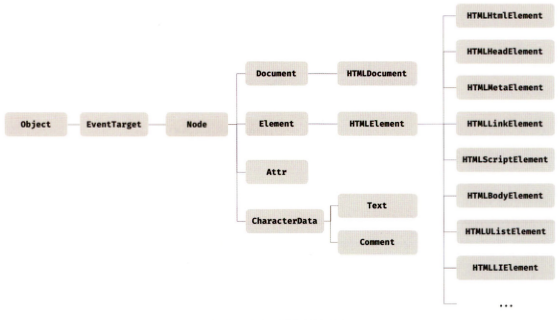
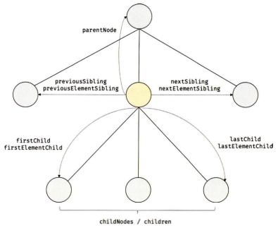

# 모던 자바스크립트 Deep Dive CH39. DOM

## Document Object Model, DOM

DOM은 HTML 문서의 계층적 구조와 정보를 표현하며 이를 제어할 수 있는 API, 즉 프로퍼티와 메서드를 제공하는 트리 자료구조다.

## 노드

### HTML 요소

* HTML 문서를 구성하는 개별적인 요소
* 렌더링 엔진에 의해 파싱되어 DOM을 구성하는 요소 노드 객체로 변환
  - 어트리뷰트 → 어트리뷰트 노드
  - 텍스트 콘텐츠 → 텍스트 노드
* 요소 간 중첩 관계에 의한 계층적인 부자 관계 형성
  - 부자 관계를 반영하여 HTML 요소를 객체화한 모든 노드 객체들을 **트리 자료 구조**로 구성
    > **DOM**: 노드 객체들로 구성된 트리 자료구조, **DOM 트리**라고도 함

> ⭐ **트리 자료구조**
>
> 부모 노드와 자식 노드로 구성되어 노드 간의 계층적 구조(부자, 형제 관계)를 표현하는 비선형 자료구조
> * **루트 노드**root node: 최상위 노드, 부모 노드가 없으며 0개 이상의 자식 노드를 갖는다.
> * **리프 노드**leaf node: 자식 노드가 없는 노드

### 노드 객체의 타입

렌더링 엔진은 HTML 문서를 파싱하여 DOM을 생성하고, DOM은 노드 객체의 계층적인 구조로 구성된다. 노드 객체는 총 12개의 종류(노드 타입)가 있고 상속 구조를 갖는다.

* **문서 노드**document node
  - DOM 트리 최상위에 존재하는 루트 노드
  - document 객체를 가리킴
    > 💭 document 객체?
    > 
    > — *브라우저가 렌더링한 HTML 문서 전체를 가리키는 객체, HTML 문서당 document 객체는 유일*
  - DOM 트리의 노드들에 접근하기 위한 진입점 역할
    + 요소, 어트리뷰트, 텍스트 노드에 접근하려면 문서 노드를 통해야 함
* **요소 노드**element node
  - HTML 요소를 가리킴
  - HTML 요소 간의 중첩에 의해 부자 관계를 갖고, 이 부자 관계를 통해 정보를 구조화
  - 문서의 구조를 표현
* **어트리뷰트 노드**attribute node
  - HTML 요소의 어트리뷰트를 가리킴
  - 어트리뷰트가 지정된 HTML 요소의 요소 노드와 연결
    > 요소 노드는 부모 노드와 연결되어 있지만, 어트리뷰트 노드는 부모 노드와 연결되어 있지 않고 요소 노드에만 연결되어 있다.
  - 부모 노드가 없기 때문에 요소 노드의 형제 노드가 아님
    + 어트리뷰트 참조/변경 시 요소 노드에 접근 필요
* **텍스트 노드**text node
  - HTML 요소의 텍스트를 가리킴
  - 문서의 정보를 표현
  - 요소 노드의 자식 노드
  - 자식 노드를 가질 수 없는 리프 노드, DOM 트리의 최종단
  - 접근 시 요소 노드에 접근 필요

### 노드 객체의 상속 구조

DOM을 구성하는 노드 객체는 자신의 구조와 정보를 제어할 수 있는 DOM API를 사용할 수 있다. 이를 통해 노드 객체는 자신의 부모, 형제, 자식을 탐색할 수 있으며, 자신의 어트리뷰트와 텍스트를 조작할 수도 있다.

DOM을 구성하는 노드 객체는 브라우저 환경에서 추가적으로 제공하는 호스트 객체다. 하지만 노드 객체도 자바스크립트 객체이므로 프로토타입에 의한 상속 구조를 갖는다. 

HTML 요소의 종류에 따라 필요한 기능을 제공하는 인터페이스가 다르다. 노드 객체는 공통된 기능일수록 프로토타입 체인의 상위에, 개별적인 고유 기능일수록 프로토타입 체인의 하위에 구축하여 노드 객체에 필요한 기능(프로퍼티와 메서드)을 제공하는 상속 구조를 갖는다. 

* **EventTarget 인터페이스**: 이벤트에 관련된 기능 제공
* **Node 인터페이스**: 노드 관련 기능 제공
* **HTMLElement 인터페이스**: HTML 요소가 갖는 공통적인 기능 제공

DOM은 HTML 문서의 계층적 구조와 정보를 표현하는 것은 물론 노드 객체의 종류(노드 타입)에 따라 필요한 기능을 프로퍼티와 메서드의 집합인 DOM API로 제공한다. DOM API를 통해 **HTML 구조나 내용 또는 스타일 등을 동적으로 조작**할 수 있다.

## 요소 노드 취득

HTML 구조나 내용 또는 스타일 등을 동적으로 조작하려면 먼저 요소 노드를 취득해야 한다. DOM은 요소 노드를 취득할 수 있는 다양한 메서드를 제공한다.

### id 이용

* `Document.prototype.getElementById` 메서드 사용
* 인수로 전달한 id 어트리뷰트 값을 갖는 하나의 요소 노드를 탐색하여 반환
  - 중복된 id 값을 갖는 요소가 여러 개인 경우: 첫 번째 요소 노드만 반환
  - 인수로 전달된 id 값을 갖는 HTML 요소가 존재하지 않는 경우: null 반환
* 반드시 문서 노드인 document를 통해 호출
* HTML 요소에 id 어트리뷰트 부여 시, id 값과 동일한 이름의 전역 변수가 암묵적으로 선언되고 해당 노드 객체가 할당되는 부수 효과 존재
  - id 값과 동일한 이름의 전역 변수가 이미 선언되어 있다면, 노드 객체가 재할당되지 않는다.

### 태그 이름 이용

* `Document.prototype/Element.prototype.getElementsByTagName` 메서드 사용
* 인수로 전달한 태그 이름을 갖는 모든 요소 노드들을 탐색하여 HTMLCollection 객체를 반환
  - 인수로 전달된 태그 이름을 갖는 요소가 존재하지 않는 경우: 빈 HTMLCollection 객체를 반환
  - 인수로 `'*'`를 전달: HTML 문서의 모든 요소 노드를 취득
  > HTMLCollection 객체: 여러 개의 요소 노드 객체를 갖는 DOM 컬렉션 객체, 유사 배열 객체이면서 이터러블
* `Document.prototype.getElementsByTagName`: document를 통해 호출, DOM 전체에서 요소 노드를 탐색하여 반환
* `Element.prototype.getElementsByTagName`: 특정 요소 노드를 통해 호출, 특정 요소 노드의 자손 노드 중에서 요소 노드를 탐색하여 반환

### class 이용

* `Document.prototype/Element.prototype.getElementsByClassName` 메서드 사용
* 인수로 전달한 class 어트리뷰트 값을 갖는 모든 요소 노드들을 탐색하여 HTMLCollection 객체를 반환
  - 인수로 전달된 class 값을 갖는 요소가 존재하지 않는 경우: 빈 HTMLCollection 객체를 반환
* `Document.prototype.getElementsByClassName`: document를 통해 호출, DOM 전체에서 요소 노드를 탐색하여 반환
* `Element.prototype.getElementsByClassName`: 특정 요소 노드를 통해 호출, 특정 요소 노드의 자손 노드 중에서 요소 노드를 탐색하여 반환

### CSS 선택자 이용

CSS 선택자 문법을 사용하는 메서드는 `getElementById`, `getElementsBy***` 메서드보다 다소 느린 것으로 알려져 있다. 하지만 좀 더 구체적인 조건으로 요소 노드를 취득할 수 있고 일관된 방식으로 요소 노드를 취득할 수 있다는 장점이 있다. 따라서 id 어트리뷰트가 있는 요소를 취득하는 경우 이외의 경우에는 아래 메서드들을 사용하는 것을 권장한다.

* `Document.prototype/Element.prototype.querySelector` 메서드 사용
* 인수로 전달한 CSS 선택자를 만족시키는 하나의 요소 노드를 탐색하여 반환
  - 인수로 전달한 CSS 선택자를 만족시키는 요소 노드가 여러 개인 경우: 첫 번째 요소 노드만 반환
  - 인수로 전달한 CSS 선택자를 만족시키는 요소 노드가 존재하지 않는 경우: null 반환
  - 인수로 전달한 CSS 선택자가 문법에 맞지 않는 경우: DOMException 에러 발생
* `Document.prototype.querySelector`: document를 통해 호출, DOM 전체에서 요소 노드를 탐색하여 반환
* `Element.prototype.querySelector`: 특정 요소 노드를 통해 호출, 특정 요소 노드의 자손 노드 중에서 요소 노드를 탐색하여 반환

* `Document.prototype/Element.prototype.querySelectorAll` 메서드 사용
* 인수로 전달한 CSS 선택자를 만족시키는 모든 요소 노드를 탐색하여 NodeList 객체를 반환
  - 인수로 전달된 CSS 선택자를 만족시키는 요소가 존재하지 않는 경우: 빈 NodeList 객체를 반환
  - 인수로 전달된 CSS 선택자가 문법에 맞지 않는 경우: DOMException 에러 발생
  - 인수로 `'*'`를 전달: HTML 문서의 모든 요소 노드를 취득
  > NodeList 객체: 여러 개의 요소 노드 객체를 갖는 DOM 컬렉션 객체, 유사 배열 객체이면서 이터러블
* `Document.prototype.querySelectorAll`: document를 통해 호출, DOM 전체에서 요소 노드를 탐색하여 반환
* `Element.prototype.querySelectorAll`: 특정 요소 노드를 통해 호출, 특정 요소 노드의 자손 노드 중에서 요소 노드를 탐색하여 반환

### 특정 요소 노드 취득 가능 여부 확인

* `Element.prototype.matches` 메서드 사용
* 인수로 전달한 CSS 선택자를 통해 특정 요소 노드를 취득할 수 있는지 확인

### HTMLCollection, NodeList

* DOM API가 여러 개의 결과값을 반환하기 위한 DOM 컬렉션 객체, 유사 배열 객체이면서 이터러블
  - `for...of` 문 순회 가능, 스프레드 문법 사용 가능
* 노드 객체의 상태 변화를 실시간으로 반영하는 live 객체
* 노드 객체의 상태 변경과 상관없이 DOM 컬렉션을 사용하려면 객체를 배열로 변환하여 사용하는 것을 권장

* **HTMLCollection:** 언제나 live 객체로 동작
  - for 문으로 순회하며 노드 객체의 상태를 변경해야 할 때 실시간으로 노드 객체의 상태 변경을 반영하여 요소를 제거할 수 있어 주의해야 함
    1. for 문을 역방향으로 순회하는 방법으로 회피 가능
    2. while 문을 사용하여 HTMLCollection 객체에 노드 객체가 남아 있지 않을 때까지 무한 반복하는 방법으로 회피 가능
    3. HTMLCollection 객체 대신 배열로 변환하여 해결 가능
* **NodeList:** 대부분의 경우 과거의 정적 상태를 유지하는 non-live 객체로 동작, 경우에 따라 live 객체로 동작
  > *childNodes 프로퍼티가 반환하는 NodeList 객체는 live 객체로 동작*

## 노드 탐색

요소 노드를 취득한 다음, 취득한 요소 노드를 기점으로 DOM 트리의 노드를 옮겨 다니며 부모, 형제, 자식 노드 등을 탐색해야 할 때가 있다. Node, Element 인터페이스는 DOM 트리 상의 노드를 탐색할 수 있도록 트리 탐색 프로퍼티를 제공한다. 

노드 탐색 프로퍼티는 모두 접근자 프로퍼티다. 단, setter 없이 getter만 존재하여 참조만 가능한 읽기 전용 접근자 프로퍼티다. 즉, 값을 할당해도 아무런 에러 없이 무시된다.

### 공백 텍스트 노드

HTML 요소 사이의 스페이스, 탭, 개행 등의 공백 문자는 공백 텍스트 노드를 생성한다. 따라서 노드를 탐색할 때 공백 문자가 생성한 공백 텍스트 노드에 주의해야 한다.

### 자식 노드 탐색

| 프로퍼티                              | 설명                                                                                                     |
| ------------------------------------- | -------------------------------------------------------------------------------------------------------- |
| `Node.prototype.childNodes`           | 자식 노드를 모두 탐색하여 NodeList에 담아 반환, 요소 노드뿐만 아니라 텍스트 노드도 포함되어 있을 수 있음 |
| `Element.prototype.children`          | 자식 노드 중에서 요소 노드만 모두 탐색하여 HTMLCollection에 담아 반환, 텍스트 노드 포함 X                |
| `Node.prototype.firstChild`           | 첫 번째 자식 노드(텍스트 노드 또는 요소 노드) 반환                                                       |
| `Node.prototype.lastChild`            | 마지막 자식 노드(텍스트 노드 또는 요소 노드) 반환                                                        |
| `Element.prototype.firstElementChild` | 첫 번째 자식 요소 노드 반환                                                                              |
| `Element.prototype.lastElementChild`  | 마지막 자식 요소 노드 반환                                                                               |

### 자식 노드 존재 확인

* `Node.prototype.hasChildNodes` 메서드 사용
* 자식 노드가 존재하면 true, 아니면 false 반환
* 텍스트 노드를 포함하여 자식 노드의 존재를 확인
* 텍스트 노드가 아닌 요소 노드가 존재하는지 확인하려면 `children.length` 또는 Element 인터페이스의 `childElementCount` 프로퍼티 사용

### 요소 노드의 텍스트 노드 탐색

* 요소 노드의 텍스트 노드: 요소 노드의 자식 노드
* firstChild 프로퍼티가 반환한 노드는 텍스트 노드이거나 요소 노드

### 부모 노드 탐색

* `Node.prototype.parentNode` 프로퍼티 사용
* 텍스트 노드는 리프 노드이므로 부모 노드가 텍스트 노드인 경우는 없음

### 형제 노드 탐색

어트리뷰트 노드는 요소 노드와 연결되어 있지만 부모 노드가 같은 형제 노드가 아니기 때문에 반환되지 않는다. 즉, 아래 프로퍼티는 텍스트 노드 또는 요소 노드만 반환한다.

| 프로퍼티                                   | 설명                                                                                                               |
| ------------------------------------------ | ------------------------------------------------------------------------------------------------------------------ |
| `Node.prototype.previousSibling`           | 부모 노드가 같은 형제 요소 노드 중에서 자신의 이전 형제 노드를 탐색하여 반환, 요소 노드 또는 텍스트 노드 반환      |
| `Node.prototype.nextSibling`               | 부모 노드가 같은 형제 요소 노드 중에서 자신의 다음 형제 요소 노드를 탐색하여 반환, 요소 노드 또는 텍스트 노드 반환 |
| `Element.prototype.previousElementSibling` | 부모 노드가 같은 형제 요소 노드 중에서 자신의 이전 형제 요소 노드를 탐색하여 반환, 요소 노드만 반환                |
| `Element.prototype.nextElementSibling`     | 부모 노드가 같은 형제 요소 노드 중에서 자신의 다음 형제 요소 노드를 탐색하여 반환, 요소 노드만 반환                |

## 노드 정보 취득

| 프로퍼티                  | 설명                                                                                                                                                                                                                                                                                               |
| ------------------------- | -------------------------------------------------------------------------------------------------------------------------------------------------------------------------------------------------------------------------------------------------------------------------------------------------- |
| `Node.prototype.nodeType` | 노드 객체의 종류(노드 타입)를 나타내는 상수를 반환, 노드 타입 상수는 Node에 정의되어 있음  - `Node.ELEMENT_NODE`: 요소 노드 타입을 나타내는 상수 1을 반환  - `Node.TEXT_NODE`: 텍스트 노드 타입을 나타내는 상수 3을 반환  - `Node.DOCUMENT_NODE`: 문서 노드 타입을 나타내는 상수 9를 반환 |
| `Node.prototype.nodeName` | 노드의 이름을 문자열로 반환  - 요소 노드: 대문자 문자열로 태그 이름(ex. `"DIV"`)을 반환  - 텍스트 노드: 문자열 `"#text"`를 반환  - 문서 노드: 문자열 `"#document"`를 반환                                                                                                                 |

## 요소 노드의 텍스트 조작

### Node.prototype.nodeValue

* setter와 getter 모두 존재하는 접근자 프로퍼티, 참조와 할당 모두 가능
* 노드 객체의 nodeValue 프로퍼티 참조시 노드 객체의 값을 반환
  > 노드 객체의 값: 텍스트 노드의 텍스트, 텍스트 노드가 아닌 노드의 nodeValue 참조시 null 반환
* 텍스트 노드의 nodeValue 프로퍼티에 값 할당시 텍스트 변경 가능
  1. 텍스트를 변경할 요소 노드를 취득한 다음, 취득한 요소 노드의 텍스트 노드를 탐색한다.
     > 텍스트 노드는 요소 노드의 자식 노드이므로 firstChild 프로퍼티 사용
  2. 탐색한 텍스트 노드의 nodeValue 프로퍼티를 사용하여 텍스트 노드의 값을 변경한다.

### Node.prototype.textContent

* setter와 getter 모두 존재하는 접근자 프로퍼티, 요소 노드의 텍스트와 모든 자손 노드의 텍스트를 모두 취득하거나 변경
* 요소 노드의 textContent 프로퍼티 참조시 요소 노드의 콘텐츠 영역 내(시작 태그와 종료 태그 사이)의 텍스트를 모두 반환
  > 이때 HTML 마크업은 무시됨
* 유사한 동작을 하는 innerText 프로퍼티가 있지만, 권장하지 않음
  - innerText 프로퍼티는 CSS에 순종적이다. (CSS에 의해 비표시로 지정된 요소 노드의 텍스트를 반환하지 않는다.)
  - innerText 프로퍼티는 CSS를 고려해야 하므로 textContent 프로퍼티보다 느리다.

## DOM 조작

> 💭 DOM 조작?
> 
> — *새로운 노드를 생성하여 DOM에 추가하거나 기존 노드를 삭제 또는 교체하는 것*

DOM 조작에 의해 DOM에 새로운 노드가 추가되거나 삭제되면 리플로우와 리페인트가 발생하는 원인이 되어 성능에 영향을 준다. 따라서 복잡한 컨텐츠를 다루는 DOM 조작은 성능 최적화를 위해 주의해야 한다.

### Element.prototype.innerHTML

* setter와 getter 모두 존재하는 접근자 프로퍼티, 요소 노드의 HTML 마크업을 취득하거나 변경
* 요소 노드의 innerHTML 프로퍼티를 참조하면 요소 노드의 콘텐츠 영역 내에 포함된 모든 HTML 마크업을 문자열로 반환
* 문자열 할당시 요소 노드의 모든 자식 노드가 제거되고 할당한 문자열에 포함되어 있는 HTML 마크업이 파싱되어 요소 노드의 자식 노드로 DOM에 반영
  - **크로스 사이트 스크립팅 공격**Cross-Site Scripting Attacks, XSS에 취약
  - 기존의 자식 노드까지 모두 제거하고 새롭게 자식 노드를 생성하여 DOM에 반영하므로 비효율적
  - 새로운 요소의 삽입될 위치를 지정할 수 없음
* 복잡하지 않은 요소를 새롭게 추가할 때 유용

### Element.prototype.insertAdjacentHTML(position, DOMString)

* 기존 요소를 제거하지 않으면서 위치를 지정해 새로운 요소를 삽입
* 두 번째 인수로 전달한 HTML 마크업 문자열을 파싱하고 그 결과로 생성된 노드를 첫 번째 인수로 전달한 위치에 삽입하여 DOM에 반영
  - 첫 번째 인수로 beforebegin, afterbegin, beforeend, afterend의 4가지 문자열 전달 가능
* 기존 요소에 영향 없이 새롭게 삽입될 요소만을 파싱하여 자식 요소로 추가하므로 innerHTML 프로퍼티보다 빠르고 효율적
* 크로스 사이트 스크립팅 공격에 취약

### 노드 생성과 추가

1. 요소 노드 생성
   - `Document.prototype.createElement(tagName)` 메서드 사용
   - 요소 노드를 생성하여 반환
   - 태그 이름을 나타내는 문자열을 인수로 전달
   - 요소 노드를 생성할 뿐 DOM에 추가하지는 않음
   - 생성한 요소 노드는 아무런 자식 노드를 가지고 있지 않음 (텍스트 노드도 없는 상태)
2. 텍스트 노드 생성
   - `Document.prototype.createTextNode(text)` 메서드 사용
   - 텍스트 노드를 생성하여 반환
   - 텍스트 노드의 값으로 사용할 문자열을 인수로 전달
   - 텍스트 노드를 생성할 뿐 요소 노드에 추가하지는 않음
3. 텍스트 노드를 요소 노드의 자식 노드로 추가
   - `Node.prototype.appendChild(childNode)` 메서드 사용
   - 인수로 전달한 노드를 appendChild 메서드를 호출한 노드의 마지막 자식 노드로 추가
4. 요소 노드를 DOM에 추가
   - 텍스트 노드와 부자 관계로 연결한 요소 노드를 기존의 DOM에 추가
   - 이때 리플로우와 리페인트 실행

### 복수의 노드 생성과 추가

DOM을 변경하는 것은 높은 비용이 드는 처리이므로 가급적 횟수를 줄이는 편이 성능에 유리하다. 따라서 여러 개의 요소 노드를 추가 할 경우 컨테이너 요소를 미리 생성해 요소 노드를 자식 노드로 추가한다면 DOM을 한 번만 변경할 수 있다. 이는 성능에는 유리하지만 불필요한 컨테이너 요소가 DOM에 추가되는 부작용이 있다.

이 문제는 DocumentFragment 노드를 사용하면 해결할 수 있다. DocumentFragment 노드는 문서, 요소, 어트리뷰트, 텍스트 노드와 같은 노드 객체의 일종으로, 부모 노드가 없어서 기존 DOM과는 별도로 존재한다는 특징이 있다. 자식 노드들의 부모 노드로서 별도의 서브 DOM을 구성하여 기존 DOM에 추가하기 위한 용도로 사용한다.

* `Document.prototype.createDocumentFragment` 메서드
  - 비어 있는 DocumentFragment 노드를 생성하여 반환
  - DocumentFragment 노드를 DOM에 추가하면 자신은 제거되고 자신의 자식 노드만 DOM에 추가

### 노드 삽입

* 마지막 노드로 추가
  - `Node.prototype.appendChild` 메서드
  - 인수로 전달받은 노드를 자신을 호출한 노드의 마지막 자식 노드로 DOM에 추가
  - 추가할 위치 지정 불가, 언제나 마지막 자식 노드로 추가
* 지정한 위치에 노드 삽입
  - `Node.prototype.insertBefore(newNode, childNode)` 메서드
  - 첫 번째 인수로 전달받은 노드를 두 번째 인수로 전달받은 노드 앞에 삽입
  - 두 번째 인수로 전달받은 노드는 반드시 insertBefore 메서드를 호출한 노드의 자식 노드여야 함
  - 두 번째 인수로 전달받은 노드가 null이면 appendChild 메서드처럼 동작

### 노드 이동

DOM에 이미 존재하는 노드를 appendChild 또는 insertBefore 메서드를 사용하여 DOM에 다시 추가하면 현재 위치에서 노드를 제거하고 새로운 위치에 노드를 추가한다. 즉, 노드가 이동한다. 

### 노드 복사

* `Node.prototype.cloneNode([deep: true | false])` 메서드
* 노드의 사본을 생성하여 반환
  - `cloneNode(true)`: 노드를 깊은 복사하여 모든 자손 노드가 포함된 사본을 생성
  - `cloneNode(false)`/`cloneNode()`: 노드를 얕은 복사하여 노드 자신만의 사본을 생성, 자손 노드 복사 X

### 노드 교체

* `Node.prototype.replaceChild(newChild, oldChild)` 메서드
* 자신을 호출한 노드의 자식 노드를 다른 노드로 교체
  - newChild: 교체할 새로운 노드
  - oldChild: 이미 존재하는 교체될 노드
  > oldChild 매개변수에 인수로 전달한 노드는 replaceChild 메서드를 호출한 노드의 자식 노드여야 함

### 노드 삭제

* `Node.prototype.removeChild(child)` 메서드
* 인수로 전달한 노드를 DOM에서 삭제
* 인수로 전달한 노드는 removeChild 메서드를 호출한 노드의 자식 노드여야 함

## 어트리뷰트

HTML 문서가 파싱될 때 HTML 요소의 어트리뷰트는 어트리뷰트 노드로 변환되어 요소 노드와 연결된다. 이때 HTML 어트리뷰트당 하나의 어트리뷰트 노드가 생성되고, 모든 어트리뷰트 노드의 참조는 NamedNodeMap 객체(유사 배열 객체이면서 이터러블)에 담겨서 요소 노드의 attributes 프로퍼티에 저장된다.

요소 노드의 모든 어트리뷰트 노드는 요소 노드의 `Element.prototype.attributes` 프로퍼티로 취득할 수 있다. attributes 프로퍼티는 getter만 존재하는 읽기 전용 접근자 프로퍼티로, 요소 노드의 모든 어트리뷰트 노드의 참조가 담긴 NamedNodeMap 객체를 반환한다.

### 어트리뷰트 조작

* `Element.prototype.getAttribute/setAttribute` 메서드
  - attributes 프로퍼티를 통하지 않고 요소 노드에서 메서드를 통해 직접 HTML 어트리뷰트 값을 취득하거나 변경 가능
  - 어트리뷰트 값 참조: `getAttribute(attributeName)`
  - 어트리뷰트 값 변경: `setAttribute(attributeName, attributeValue)`

* `Element.prototype.hasAttribute(attributeName)` 메서드
  - 특정 HTML 어트리뷰트가 존재하는지 확인

* `Element.prototype.removeAttribute(attributeName)` 메서드
  - 특정 HTML 어트리뷰트 삭제

### HTML 어트리뷰트 vs. DOM 프로퍼티

요소 노드 객체에는 HTML 어트리뷰트에 대응하는 프로퍼티가 존재한다. 이 DOM 프로퍼티들은 HTML 어트리뷰트 값을 초기값으로 가지고 있다. DOM 프로퍼티는 setter와 getter 모두 존재하는 접근자 프로퍼티로, 참조와 변경이 가능하다.

HTML 어트리뷰트는 아래와 같이 DOM에서 중복 관리되고 있는 것처럼 보이지만, 그렇지 않다.

1. 요소 노드의 attributes 프로퍼티에서 관리하는 어트리뷰트 노드
2. HTML 어트리뷰트에 대응하는 요소 노드의 프로퍼티(DOM 프로퍼티)

요소 노드는 상태를 가지고 있어, 아래 2개의 상태를 관리해야 한다.

* 초기 상태: 어트리뷰트 노드가 관리
* 최신 상태: DOM 프로퍼티가 관리

| 어트리뷰트 노드                                                                                                                                                                   | DOM 프로퍼티                                                                                                                                                                                                          |
| --------------------------------------------------------------------------------------------------------------------------------------------------------------------------------- | --------------------------------------------------------------------------------------------------------------------------------------------------------------------------------------------------------------------- |
| - HTML 어트리뷰트로 지정한 HTML 요소의 초기 상태 관리 - 사용자의 입력에 의해 상태가 변경되어도 초기 상태 유지 - `getAttribute/setAttribute` 메서드로 초기 상태 값 취득/변경 | - 사용자가 입력한 최신 상태 관리 - 사용자의 입력에 의한 상태 변화에 반응하여 언제나 최신 상태 유지 - DOM 프로퍼티에 값 할당시 사용자가 상태를 변경하는 행위와 동일, HTML 요소에 지정한 어트리뷰트 값에는 영향 X |

#### HTML 어트리뷰트와 DOM 프로퍼티의 대응 관계

대부분의 HTML 어트리뷰트는 HTML 어트리뷰트 이름과 동일한 DOM 프로퍼티와 1:1로 대응한다. 그러나 아래와 같이 언제나 1:1 대응은 아니며, HTML 어트리뷰트 이름과 DOM 프로퍼티 키가 반드시 일치하는 것도 아니다.

* id 어트리뷰트와 id 프로퍼티는 1:1 대응하며, 동일한 값으로 연동한다.
* input 요소의 value 어트리뷰트는 value 프로퍼티와 1:1 대응한다. 하지만 value 어트리뷰트는 초기 상태를, value 프로퍼티는 최신 상태를 갖는다.
* class 어트리뷰트는 className, classList 프로퍼티와 대응한다.
* for 어트리뷰트는 htmlFor 프로퍼티와 1:1 대응한다.
* td 요소의 colspan 어트리뷰트는 대응하는 프로퍼티가 존재하지 않는다.
* textcontent 프로퍼티는 대응하는 어트리뷰트가 존재하지 않는다.
* 어트리뷰트 이름은 대소문자를 구별하지 않지만 대응하는 프로퍼티 키는 카멜 케이스를 따른다(maxlength → maxLength).

### data 어트리뷰트와 dataset 프로퍼티

HTML 요소에 정의한 사용자 정의 어트리뷰트와 자바스크립트 간에 데이터를 교환할 수 있다. data 어트리뷰트는 `data-` 접두사 다음에 임의의 이름을 붙여 사용한다.

data 어트리뷰트 값은 `HTMLElement.dataset` 프로퍼티로 취득할 수 있다. dataset 프로퍼티는 HTML 요소의 모든 data 어트리뷰트의 정보를 제공하는 DOMStringMap 객체를 반환한다. 이 객체는 data 어트리뷰트의 `data-` 접두사 다음에 붙인 임의의 이름을 카멜 케이스로 변환(`data-user-id` → `userId`)한 프로퍼티를 가지고 있다. 이 프로퍼티로 어트리뷰트 값을 취득하거나 변경할 수 있다.

## 스타일

### 인라인 스타일 조작

* `HTMLElement.prototype.style` 프로퍼티 사용
* setter와 getter 모두 존재하는 접근자 프로퍼티, 요소 노드의 인라인 스타일을 취득하거나 추가 또는 변경
* style 프로퍼티 참조시 CSSStyleDeclaration 타입의 객체 반환
  > CSSStyleDeclaration 객체: 다양한 CSS 프로퍼티에 대응하는 프로퍼티 보유
* 표기법
  - CSS: 케밥 케이스 ex. background-color
  - CSSStyleDeclaration 객체의 프로퍼티: 카멜 케이스 ex. backgroundColor
  > 대괄호 표기법을 사용하면 케밥 케이스 그대로 사용 가능
* 단위 지정
  - 단위 지정이 필요한 CSS 프로퍼티 값은 반드시 단위를 지정해야 함

### 클래스 조작

클래스 선택자를 사용하여 CSS class를 미리 정의한 다음, HTML 요소의 class 어트리뷰트 값을 변경하여 HTML 요소의 스타일을 변경할 수도 있다. 이때 class 어트리뷰트에 대응하는 요소 노드의 DOM 프로퍼티를 사용하며, class가 아니라 className과 classList다.

* `Element.prototype.className` 프로퍼티
  - setter와 getter 모두 존재하는 접근자 프로퍼티, HTML 요소의 class 어트리뷰트 값을 취득하거나 변경
  - 참조: class 어트리뷰트 값을 문자열로 반환, 구분된 여러 개의 클래스를 반환하는 경우 불편
  - 할당: class 어트리뷰트 값을 할당한 문자열로 변경

* `Element.prototype.classList` 프로퍼티
  - class 어트리뷰트의 정보를 담은 DOMTokenList 객체를 반환
  - DOMTokenList 객체: class 어트리뷰트의 정보를 나타내는 컬렉션 객체, 유사 배열 객체이면서 이터러블. 아래 메서드 제공
    + `add(...className)`: 인수로 전달한 1개 이상의 문자열을 class 어트리뷰트 값으로 추가
    + `remove(...className)`: 인수로 전달한 1개 이상의 문자열과 일치하는 클래스를 class 어트리뷰트에서 삭제
    + `item(index)`: 인수로 전달한 index에 해당하는 클래스를 class 어트리뷰트에서 반환
    + `contains(className)`: 인수로 전달한 문자열과 일치하는 클래스가 class 어트리뷰트에 포함되어 있는지 확인
    + `replace(oldClassName, newClassName)`: class 어트리뷰트에서 첫 번째 인수로 전달한 문자열을 두 번째 인수로 전달한 문자열로 변경
    + `toggle(className[, force])`: class 어트리뷰트에 인수로 전달한 문자열과 일치하는 클래스가 존재하면 제거, 존재하지 않으면 추가
    + `forEach`, `entries`, `keys`, `values`, `supports` 메서드

### 요소에 적용된 CSS 스타일 참조

* `window.getComputedStyle(element[, pseudo])` 메서드
  - element로 전달한 요소 노드에 적용되어 있는 평가된 스타일을 CSSStyleDeclaration 객체에 담아 반환
    > 평가된 스타일: 요소 노드에 적용되어 있는 모든 스타일이 조합되어 최종적으로 적용된 스타일
  - 두 번째 인수로 :after, :before와 같은 의사 요소를 지정하는 문자열 전달 가능