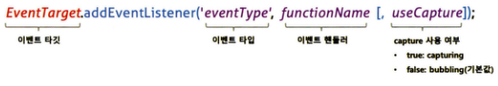
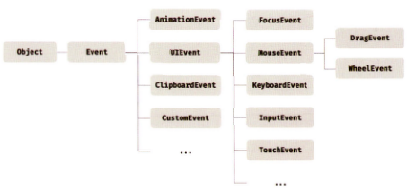

# 모던 자바스크립트 Deep Dive CH40. 이벤트

## 이벤트 드리븐 프로그래밍

브라우저는 처리해야 할 특정 사건이 발생하면 이를 감지하여 이벤트를 발생시킨다. 만약 애플리케이션이 특정 타입의 이벤트에 대해 반응하여 어떤 일을 하고 싶다면 해당하는 타입의 이벤트가 발생했을 때 호출될 함수를 브라우저에게 알려 호출을 위임한다. 이벤트와 그에 대응하는 함수를 통해 사용자와 애플리케이션은 상호작용 할 수 있다.

* **이벤트 핸들러**<sup>event handler</sup>: 이벤트가 발생했을 때 호출될 함수
* **이벤트 핸들러 등록**: 이벤트가 발생했을 때 브라우저에게 이벤트 핸들러의 호출을 위임하는 것
* **이벤트 드리븐 프로그래밍**<sup>event-driven programming</sup>: 프로그램의 흐름을 이벤트 중심으로 제어하는 프로그래밍 방식

## 이벤트 타입

이벤트 타입은 이벤트의 종류를 나타내는 문자열을 말한다. 마우스, 키보드, 포커스, 폼, 값 변경, DOM 뮤테이션 등 약 200여 가지의 타입이 있다. *— [참고](https://developer.mozilla.org/en-US/docs/Web/Events#event_index)*

## 이벤트 핸들러 등록

이벤트 핸들러를 등록하는 방법은 3가지다.

### 1. 이벤트 핸들러 어트리뷰트 방식

HTML 요소의 어트리뷰트 중, 이벤트에 대응하는 이벤트 핸들러 어트리뷰트가 있다. 이는 on 접두사와 이벤트의 종류를 나타내는 이벤트 타입(ex. onclick)으로 이루어져 있다. 이벤트 핸들러 어트리뷰트 값으로 함수 호출문 등의 문을 할당하면 이벤트 핸들러가 등록된다.

> **※ 주의:** 이벤트 핸들러 어트리뷰트 값으로 함수 참조가 아닌 함수 호출문 등의 문을 할당한다.

```html
<button onclick="handleClick('Clicked!')">Click here</button>
<script>
  function handleClick(message) {
    console.log(message);
  }
</script>
```

이벤트 핸들러 등록은 함수 호출을 브라우저에게 위임하는 것이기 때문에 함수 참조를 등록해야 브라우저가 이벤트 핸들러를 호출할 수 있다. 만약 함수 호출문을 등록하면 함수 호출문의 평가 결과가 이벤트 핸들러로 등록된다. 그러나 위 예제에서는 이벤트 핸들러 어트리뷰트 값으로 함수 호출문을 할당했다. 이때 이벤트 핸들러 어트리뷰트 값은 사실 암묵적으로 생성될 이벤트 핸들러의 함수 몸체를 의미한다. `onclick="handleClick('Clicked!')"` 어트리뷰트는 파싱되어 아래와 같은 함수를 암묵적으로 생성하고, 이벤트 핸들러 어트리뷰트 이름과 동일한 키 onclick 이벤트 핸들러 프로퍼티에 할당한다.

```js
function onclick(event) {
  handleClick('Clicked!');
}
```

이와 같이 동작하는 이유는 이벤트 핸들러에 인수를 전달하기 위해서다. 결국 이벤트 핸들러 어트리뷰트 값으로 할당한 문자열은 암묵적으로 생성되는 이벤트 핸들러의 함수 몸체다. 따라서 이벤트 핸들러 어트리뷰트 값으로 다음과 같이 여러 개의 문을 할당할 수 있다.

```html
<button onclick="console.log('Hello, '); console.log('World!');">Click here</button>
```

이벤트 핸들러 어트리뷰트 방식은 더는 사용하지 않는 것이 좋지만, 모던 자바스크립트의 **CBD**<sup>Component Based Development</sup> 방식의 Angular/React/Svelte/Vue.js 같은 프레임워크/라이브러리에서는 사용한다. CBD에서는 HTML, CSS, 자바스크립트를 뷰를 구성하기 위한 구성 요소로 보기 때문에 관심사가 다르다고 생각하지 않는다.

### 2. 이벤트 핸들러 프로퍼티 방식

window 객체와 Document, HTMLElement 타입의 DOM 노드 객체는 이벤트에 대응하는 이벤트 핸들러 프로퍼티를 가지고 있다. 이벤트 핸들러 프로퍼티의 키는 이벤트 핸들러 어트리뷰트와 마찬가지로 on 접두사와 이벤트의 종류를 나타내는 이벤트 타입으로 이루어져 있다. 이벤트 핸들러 프로퍼티에 함수를 바인딩하면 이벤트 핸들러가 등록된다.

이벤트 핸들러를 등록하기 위해서는 이벤트 타깃, 이벤트 타입, 이벤트 핸들러를 지정할 필요가 있다.

* **이벤트 타깃:** 이벤트를 발생시킬 객체
* **이벤트 타입:** 이벤트의 종류
* **이벤트 핸들러:** 함수

```html
<button>Click here</button>
<script>
  const $button = document.querySelector('button');

  // 이벤트 핸들러 프로퍼티에 이벤트 핸들러를 바인딩
  $button.onclick = function () {
    console.log('Clicked!');
  };
</script>
```

이벤트 핸들러는 대부분 이벤트를 발생시킬 이벤트 타깃에 바인딩하지만, 반드시 그래야 하는 것은 아니다. 이벤트 핸들러는 이벤트 타깃 또는 전파된 이벤트를 캐치할 DOM 노드 객체에 바인딩한다. 

*이벤트 핸들러 어트리뷰트 방식*도 결국 DOM 노드 객체의 이벤트 핸들러 프로퍼티로 변환되므로 결과적으로 *이벤트 핸들러 프로퍼티 방식*과 동일하다고 할 수 있다. *이벤트 핸들러 프로퍼티 방식*은 HTML과 자바스크립트가 뒤섞이는 문제를 해결할 수 있지만, 이벤트 핸들러 프로퍼티에 하나의 이벤트 핸들러만 바인딩할 수 있다는 단점이 있다.

### 3. addEventListener 메서드 방식

<center></center>

```html
<button>Click here</button>
<script>
  const $button = document.querySelector('button');

  $button.addEventListener('click', function () {
    console.log('Clicked!');
  });
</script>
```

addEventListener 메서드에는 이벤트 핸들러를 인수로 전달한다. addEventListener 메서드 방식은 이벤트 핸들러 프로퍼티에 바인딩된 이벤트 핸들러에 아무런 영향을 주지 않는다. 따라서 이벤트 핸들러 프로퍼티 방식과 addEventListener 메서드 방식을 모두 사용하여 이벤트 핸들러를 등록했다면, 모두 호출된다.

addEventListener 메서드는 하나 이상의 이벤트 핸들러를 등록할 수 있다. 이때 이벤트 핸들러는 등록된 순서대로 호출된다. 단, addEventListener 메서드를 통해 참조가 동일한 이벤트 핸들러를 중복 등록하면 하나의 이벤트 핸들러만 등록된다.

## 이벤트 핸들러 제거

* `EventTarget.prototype.removeEventListener` 메서드 사용
  - 전달할 인수는 addEventListener 메서드와 동일
    > 전달한 이벤트 핸들러는 addEventListener 메서드에 인수로 전달한 등록 이벤트 핸들러와 동일한 함수여야 함
  - 기명 이벤트 핸들러 내부에서 이벤트 핸들러 제거 가능
    > 이때 이벤트 핸들러는 단 한 번만 호출
  - 기명 함수를 이벤트 핸들러로 등록할 수 없다면, 호출된 함수 자신을 가리키는 `arguments.callee` 사용 가능
    + 코드 최적화를 방해하기 때문에 strict mode에서 사용 금지
  - 이벤트 핸들러 프로퍼티 방식으로 등록한 이벤트 핸들러는 제거 불가
    + 이 경우, null을 할당

## 이벤트 객체

이벤트가 발생하면 이벤트에 관련한 다양한 정보를 담고 있는 이벤트 객체가 동적으로 생성된다. 생성된 이벤트 객체는 이벤트 핸들러의 첫 번째 인수로 전달된다.

브라우저가 이벤트 핸들러를 호출할 때 이벤트 객체를 인수로 전달한다. 따라서 이벤트 객체를 전달받으려면 이벤트 핸들러를 정의할 때 이벤트 객체를 전달받을 매개변수를 명시적으로 선언해야 한다. 

이벤트 핸들러 어트리뷰트 방식으로 이벤트 핸들러를 등록했다면 event를 통해 이벤트 객체를 전달받을 수 있다. 이 방식의 경우 이벤트 핸들러의 첫 번째 매개변수 이름이 반드시 event여야 한다. 다른 이름으로는 이벤트 객체를 전달받지 못한다. 이는 이벤트 핸들러 어트리뷰트 값이 사실 암묵적으로 생성되는 이벤트 핸들러의 함수 몸체를 의미하는데, 이때 생성된 이벤트 핸들러의 첫 번째 매개 변수 이름이 event로 암묵적으로 명명되기 때문이다.

### 상속 구조

이벤트가 발생하면 이벤트 타입에 따라 다양한 타입의 이벤트 객체가 생성된다. 이벤트 객체는 아래와 같은 상속 구조를 갖는다. 

<center></center>

이벤트 객체도 생성자 함수로 생성할 수 있다. 생성된 이벤트 객체는 생성자 함수와 더불어 생성되는 프로토타입으로 구성된 프로토타입 체인의 일원이 된다. 이벤트 객체 중 일부는 사용자의 행위에 의해 생성된 것이고 일부는 자바스크립트 코드에 의해 인위적으로 생성된 것이다. 

Event 인터페이스는 DOM 내에서 발생한 이벤트에 의해 생성되는 이벤트 객체를 나타낸다. Event 인터페이스에는 모든 이벤트 객체의 공통 프로퍼티가 정의되어 있고 FocusEvent, MouseEvent, KeyboardEvent, WheelEvent 같은 하위 인터페이스에는 이벤트 타입에 따라 고유한 프로퍼티가 정의되어 있다.

### 공통 프로퍼티

Event 인터페이스(`Event.prototype`)에 정의되어 있는 이벤트 관련 프로퍼티는 모든 파생 이벤트 객체에 상속된다. 즉, Event 인터페이스의 이벤트 관련 프로퍼티는 모든 이벤트 객체가 상속받는 공통 프로퍼티다. 이벤트 객체의 공통 프로퍼티는 아래와 같다.

| 공통 프로퍼티    | 설명                                                                                                                                                                                                                                                        | 타입          |
| ---------------- | ----------------------------------------------------------------------------------------------------------------------------------------------------------------------------------------------------------------------------------------------------------- | ------------- |
| type             | 이벤트 타입                                                                                                                                                                                                                                                 | string        |
| target           | 이벤트를 발생시킨 DOM 요소                                                                                                                                                                                                                                  | DOM 요소 노드 |
| currentTarget    | 이벤트 핸들러가 바인딩된 DOM 요소                                                                                                                                                                                                                           | DOM 요소 노드 |
| eventPhase       | 이벤트 전파 단계<br>**0:** 이벤트 없음<br>**1:** 캡처링 단계<br>**2:** 타깃 단계<br>**3:** 버블링 단계                                                                                                                                                      | number        |
| bubbles          | 이벤트를 버블링으로 전파하는지 여부. 다음 이벤트는 `bubbles: false`로 버블링하지 않는다.<br>- 포커스 이벤트 focus/blur<br>- 리소스 이벤트 load/unload/abort/error<br>- 마우스 이벤트 mouseenter/mouseleave                                                  | boolean       |
| cancelable       | preventDefault 메서드를 호출하여 이벤트의 기본 동작을 취소할 수 있는지 여부. 다음 이벤트는 `cancelable: false`로 취소할 수 없다.<br>- 포커스 이벤트 focus/blur<br>- 리소스 이벤트 load/unload/abort/error<br>- 마우스 이벤트 dblclick/mouseenter/mouseleave | boolean       |
| defaultPrevented | preventDefault 메서드를 호출하여 이벤트를 취소했는지 여부                                                                                                                                                                                                   | boolean       |
| isTrusted        | 사용자의 행위에 의해 발생한 이벤트인지 여부                                                                                                                                                                                                                 | boolean       |
| timeStamp        | 이벤트가 발생한 시각(1970/01/01/00:00:0부터 경과한 밀리초)                                                                                                                                                                                                  | number        |

### 마우스 정보 취득

MouseEvent 타입의 이벤트 객체는 아래와 같은 고유의 프로퍼티를 갖는다.

* **마우스 포인터의 좌표 정보를 나타내는 프로퍼티:** screenX/screenY, clientX/clientY, pageX/pageY, offsetX/offsetY
* **버튼 정보를 나타내는 프로퍼티:** altKey, ctrlKey, shiftKey, button

마우스 포인터 좌표는 MouseEvent 타입의 이벤트 객체에서 제공한다. 제공하는 프로퍼티 중 clientX/clientY는 뷰포트(웹 페이지의 가시 영역)를 기준으로 마우스 포인터 좌표를 나타낸다.

### 키보드 정보 취득

KeyboardEvent 타입의 이벤트 객체는 altKey, ctrlKey, shiftKey, metaKey, key, keyCode 같은 고유의 프로퍼티를 갖는다. 이 중 key 프로퍼티는 입력한 키 값을 문자열로 반환한다. 입력한 키와 key 프로퍼티 값의 대응 관계는 [이 곳](https://www.toptal.com/developers/keycode)을 참고하면 된다.

## 이벤트 전파

DOM 트리 상에 존재하는 DOM 요소 노드에서 발생한 이벤트는 DOM 트리를 통해 전파된다. 이를 **이벤트 전파**<sup>event propagation</sup>라 한다.

이벤트가 발생하여 생성된 이벤트 객체는 이벤트를 발생시킨 DOM 요소인 이벤트 타깃을 중심으로 DOM 트리를 통해 전파된다. 이벤트 전파는 이벤트 객체가 전파되는 방향에 따라 3단계로 구분할 수 있다.

* **캡처링 단계**<sup>capturing phase</sup>: 이벤트가 상위 요소에서 하위 요소 방향으로 전파
* **타깃 단계**<sup>target phase</sup>: 이벤트가 이벤트 타깃에 도달
* **버블링 단계**<sup>bubbling phase</sup>: 이벤트가 하위 요소에서 상위 요소 방향으로 전파

이벤트 핸들러 어트리뷰트/프로퍼티 방식으로 등록한 이벤트 핸들러는 타깃 단계와 버블링 단계의 이벤트만 캐치할 수 있다. 하지만 addEventListener 메서드 방식으로 등록한 이벤트 핸들러는 타깃 단계와 버블링 단계뿐만 아니라 캡처링ㅇ 단계의 이벤트도 선별적으로 캐치할 수 있다. 캡처링 단계의 이벤트를 캐치하려면 메서드의 3번째 인수로 true를 전달해야 한다. 

이벤트는 이벤트를 발생시킨 이벤트 타깃은 물론 상위 DOM 요소에서도 캐치할 수 있다. 즉, DOM 트리를 통해 전파되는 이벤트는 이벤트 패스에 위치한 모든 DOM 요소에서 캐치할 수 있다.

> 💭 이벤트 패스?
> 
> — *이벤트가 통과하는 DOM 트리 상의 경로로, `Event.prototype.composedPath` 메서드로 확인할 수 있다.*

대부분의 이벤트는 캡처링과 버블링을 통해 전파되지만, 아래 이벤트는 버블링을 통해 전파되지 않는다.

* **포커스 이벤트**: focus/blur
  - 버블링을 통해 전파되는 focusin/focusout으로 대체 가능
* **리소스 이벤트**: load/unload/abort/error
  - 버블리을 통해 전파되는 mouseover/mouseout으로 대체 가능
* **마우스 이벤트**: mouseenter/mouseleave

위 이벤트는 버블링 되지 않으므로 이벤트 타깃의 상위 요소에서 위 이벤트를 캐치하려면 캡처링 단계의 이벤트를 캐치해야 한다. 그러나 대체할 수 있는 이벤트가 존재하기 때문에 캡처링 단계에서 이벤트를 캐치해야 할 경우는 거의 없다.

## 이벤트 위임

**이벤트 위임**<sup>event delegation</sup>은 여러 개의 하위 DOM 요소에 각각 이벤트 핸들러를 등록하는 대신 하나의 상위 DOM 요소에 이벤트 핸들러를 등록하는 방법을 말한다. 이벤트 위임을 통해 상위 DOM 요소에 이벤트 핸들러를 등록하면 여러 개의 하위 DOM 요소에 이벤트 핸들러를 등록할 필요가 없다. 또한 동적으로 하위 DOM 요소를 추가하더라도 일일이 추가된 DOM 요소에 이벤트 핸들러를 등록할 필요가 없다.

> **※ 주의:** 상위 요소에 이벤트 핸들러를 등록하기 때문에 이벤트를 실제로 발생시킨 DOM 요소(이벤트 타깃)가 개발자가 기대한 DOM 요소가 아닐 수도 있다.

> ⭐ **`Element.prototype.matches` 메서드**
>
> 인수로 전달된 선택자에 의해 특정 노드를 탐색 가능한지 확인한다. 이를 이용해 이벤트에 반응이 필요한 DOM 요소에 한정하여 이벤트 핸들러가 실행되도록 이벤트 타깃을 검사할 수 있다.

일반적으로 이벤트 객체의 target과 currentTarget 프로퍼티는 동일한 DOM 요소를 가리키지만 이벤트 위임을 통해 상위 DOM 요소에 이벤트를 바인딩한 경우 다른 요소를 가리킬 수 있다. 

## DOM 요소의 기본 동작 조작

* **기본 동작 중단**
  - 이벤트 객체의 preventDefault 메서드
* **이벤트 전파 방지**
  - 이벤트 객체의 stopPropagation 메서드
  - 하위 DOM 요소의 이벤트를 개별적으로 처리하기 위해 이벤트의 전파를 중단

## 이벤트 핸들러 내부의 this

* **이벤트 핸들러 어트리뷰트 방식**
  - 전역 객체 window를 가리킴
  - 일반 함수로서 호출되는 함수 내부의 this는 전역 객체를 가리키기 때문
    > 이벤트 핸들러 어트리뷰트의 값으로 지정한 문자열은 이벤트 핸들러에 의해 일반 함수로 호출
* **이벤트 핸들러 프로퍼티 방식, addEventListener 메서드 방식**
  - 이벤트를 바인딩한 DOM 요소를 가리킴 (이벤트 객체의 currentTarget 프로퍼티와 동일)
  - 화살표 함수로 정의한 이벤트 핸들러 내부의 this는 상위 스코프의 this를 가리킴
  > **※ 주의:** 클래스에서 이벤트 핸들러를 바인딩하는 경우, bind 메서드를 사용해 this를 전달하여 클래스가 생성할 인스턴스를 가리키도록 해야한다. 또는 클래스 필드에 할당한 화살표 함수를 이벤트 핸들러로 등록하는 방법이 있다.

## 이벤트 핸들러에 인수 전달

함수에 인수를 전달하려면 함수를 호출할 때 전달해야 한다. 이벤트 핸들러 프로퍼티 방식과 addEventListener 메서드 방식의 경우 이벤트 핸들러를 브라우저가 호출하기 때문에 함수 자체를 등록해야 해 인수를 전달할 수 없다. 그러나 인수를 전달할 방법이 없는 것은 아니다.

1. 이벤트 핸들러 내부에서 함수를 호출하면서 인수 전달
    ```html
    <label>ID <input type='text'></label>
    <em class="message"></em>
    <script>
      const MIN_ID_LENGTH = 8;
      const $input = document.querySelector('input[type=text]');
      const $msg = document.querySelector('.message');

      const checkIDLength = min => {
        $msg.textContent = $input.value.length < min ? `ID는 ${min}자 이상 입력해 주세요.` : '';
      };

      // 이벤트 핸들러 내부에서 함수를 호출하면서 인수 전달
      $input.onblur = () => {
        checkIDLength(MIN_ID_LENGTH);
      };
    </script>
    ```
2. 이벤트 핸들러를 반환하는 함수를 호출하면서 인수 전달
    ```html
    <label>ID <input type='text'></label>
    <em class="message"></em>
    <script>
      const MIN_ID_LENGTH = 8;
      const $input = document.querySelector('input[type=text]');
      const $msg = document.querySelector('.message');

      // 이벤트 핸들러를 반환하는 함수
      const checkIDLength = min => e => {
        $msg.textContent = $input.value.length < min ? `ID는 ${min}자 이상 입력해 주세요.` : '';
      };

      // 이벤트 핸들러를 반환하는 함수를 호출하면서 인수 전달
      $input.onblur = checkIDLength(MIN_ID_LENGTH);
    </script>
    ```

## 커스텀 이벤트

이벤트 생성자 함수를 호출하여 명시적으로 생성한 이벤트 객체는 임의의 이벤트 타입을 지정할 수 있다. 이처럼 개발자의 의도로 생성된 이벤트를 커스텀 이벤트라 한다. 

이벤트 생성자 함수는 첫 번째 인수로 이벤트 타입을 나타내는 문자열을 전달받는다. 이때 기존 이벤트 타입을 사용할 수도 있고, 기존 이벤트 타입이 아닌 임의의 문자열을 사용해 새로운 이벤트 타입을 지정할 수도 있다. 이 경우 일반적으로 CustomEvent 이벤트 생성자 함수를 사용한다.

```js
// click 이벤트 타입의 커스텀 이벤트 객체 생성
const mouseEvent = new MouseEvent('click');

// hello 이벤트 타입의 커스텀 이벤트 객체 생성
const customEvent = new CustomEvent('hello');
```

커스텀 이벤트 객체는 bubbles와 cancelable 프로퍼티의 값이 false로 기본 설정된다. true로 설정하려면 이벤트 생성자 함수의 두 번째 인수로 bubbles 또는 cancelable 프로퍼티를 갖는 객체를 전달한다.

```js
const customEvent = new MouseEvent('click', {
  bubbles: true,
  cancelable: true
});
```

커스텀 이벤트 객체에는 이벤트 타입에 따라 가지는 이벤트 고유의 프로퍼티 값을 지정할 수 있다. 그러려면 이벤트 생성자 함수의 두 번째 인수로 프로퍼티를 전달한다.

```js
const customEvent = new MouseEvent('click', {
  bubbles: true,
  cancelable: true,
  screenX: 50
});
```

이벤트 생성자 함수로 생성한 커스텀 이벤트는 isTrusted 프로퍼티의 값이 언제다 false다. 사용자의 행위에 의해 발생한 이벤트에 의해 생성된 이벤트 객체의 isTrusted 프로퍼티 값은 언제나 true다.

### 디스패치

생성된 커스텀 이벤트는 dispatchEvent 메서드로 디스패치 할 수 있다.

> 💭 디스패치?
> 
> — *이벤트를 발생시키는 행위*

dispatchEvent 메서드에 이벤트 객체를 인수로 전달하면서 호출하면 인수로 전달한 이벤트 타입의 이벤트가 발생한다. 일반적으로 이벤트 핸들러는 비동기 처리 방식으로 동작하지만 dispatchEvent 메서드는 이벤트 핸들러를 동기 처리 방식으로 호출한다. 다시 말해, dispatchEvent 메서드를 호출하면 커스텀 이벤트에 바인딩된 이벤트 핸들러를 직접 호출하는 것과 같다. 따라서 dispatchEvent 메서드로 이벤트를 디스패치하기 이전에 커스텀 이벤트를 처리할 이벤트 핸들러를 등록해야 한다. 

임의의 이벤트 타입을 지정하여 커스텀 이벤트 객체를 생성한 경우 반드시 addEventListener 메서드 방식으로 이벤트 핸들러를 등록해야 한다. 'on + 이벤트 타입'으로 이루어진 이벤트 핸들러 어트리뷰트/프로퍼티가 요소 노드에 존재하지 않기 때문에 이벤트 핸들러 어트리뷰트/프로퍼티 방식은 사용할 수 없다.