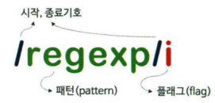

### ✏️ 정규 표현식(regular expression)이란?

일정한 패턴을 가진 문자열의 집합을 표현하기 위해 사용하는 형식 언어(format language)이며 자바스크립트의 고유 문법이 아니며 대부분의 프로그래밍 언어와 코드 에디터에 내장되어 있다.

문자열을 대상으로 패턴 매칭 기능을 제공하는데 이는 특정 패턴과 일치하는 문자열을 검색하거나 추출, 치환할 수 있는 기능을 말한다. 정규표현식을 사용하면 반복문과 조건문 없이 패턴을 정의하고 테스트하는 것으로 간단히 체크할 수 있지만 정규표현식은 주석이나 공백을 허용하지 않고 여러 가지 기호를 혼합하여 사용하기 때문에 가독성이 좋지 않다.

### ✏️ 정규 표현식의 생성

정규 표현식은 다음과 같이 표현하며 정규 표현식 리터럴, RegExp 생성자 함수로 생성할 수 있다.



1. **정규 표현식 리터럴**

   ```jsx
   const testLowerString = "I'm gaori";
   const testUpperString = "I'm GAORI";

   // 패턴: is | 플래그: i (대소문자 구분X)
   const findString = /gaori/i;

   // test(): 문자열에 대해 정규표현식 findString의 패턴을 검사하여 매칭 결과를 불리언 값으로 반환
   findString.test(testUpperString); // true
   findString.test(testLowerString); // true
   ```

2. **RegExp 생성자 함수**

   ```jsx
   const testString = "I'm gaori";
   const findString = new RegExp(/gaori/i); // ES6
   // const regexp = new RegExp(/gaori/, 'i');
   // const regexp = new RegExp('gaori', 'i');

   console.log(findString.test(testString)); // true
   ```

### ✏️ RegExp 메서드

1. **RegExp.prototype.exec**

   인수로 전달받은 문자열에 대해 정규 표현식의 패턴을 검색하여 매칭 결과를 배열로 반환하며 매칭 결과가 없는 경우 `null`을 반환한다.

   ```jsx
   const testString = "I'm gaori";
   const findString1 = /gaori/;
   const findString2 = /coco/;

   findString1.exec(testString); // [ 'gaori', index: 4, input: "I'm gaori", groups: undefined ]
   findString2.exec(testString); // null
   ```

2. **RegExp.prototype.test**

   인수로 전달받은 문자열에 대해 정규 표현식의 패턴을 검색하여 매칭 결과를 불리언 값으로 반환한다.

   ```jsx
   const testString = "I'm gaori";
   const findString1 = /gaori/;
   const findString2 = /coco/;

   console.log(findString1.test(testString)); // true
   console.log(findString2.test(testString)); // false
   ```

3. **String.prototype.match**

   대상 문자열과 인수로 전달받은 정규 표현식과의 매칭 결과를 배열로 반환한다.

   ```jsx
   const testString = "I'm gaori, gaori";
   const findString1 = /gaori/g;
   const findString2 = /coco/g;

   testString.match(findString1); // [ 'gaori', 'gaori' ]
   testString.match(findString2); // null
   ```

### ✏️ 플래그

정규 표현식의 검색 방식을 설정하기 위해 사용한다. 플래그는 옵션이며 순서와 상관없이 하나 이상의 플래그를 동시에 설정할 수 있다. 플래그를 사용하지 않으면 대소문자를 구별하고, 문자열 패턴 검색 매칭 대상이 1개 이상 존재해도 첫 번째 매칭한 대상만 검색한 후 종료한다.

| i   | Ignore case | 대소문자 구별 없이 패턴 검색                             |
| --- | ----------- | -------------------------------------------------------- |
| g   | Global      | 대상 문자열 내에서 패턴과 일치하는 모든 문자열 전역 검색 |
| m   | Multi line  | 문자열의 행이 바귀더라도 계속 패턴 검색                  |

### ✏️ 패턴

문자열의 일정한 규칙을 표현하기 위해 사용한다. 패턴은 `/`로 열고 닫으며 문자열의 따옴표는 생략하며 특별한 의미를 가지는 메타문자나 기호로 표현할 수 있다.

1. **문자열 검색**

   정규 표현식의 패턴에 문자나 문자열을 지정한다.

2. **임의의 문자열 검색**

   `.`은 문자 한 개를 의미하며 문자의 내용은 어떤 것이든 상관없다. `…`을 사용한다면 문자의 내용과 상관없이 3자리 문자열과 매치한다.

3. **반복 검색**

   `{m,n}`은 최소 m번, 최대 n번 반복되는 문자열을 의미하며 콤마 뒤에 공백이 있으면 정상 동작하지 않는다.

   `{n}` : n번 반복되는 문자열을 의미한다. → `{n,n}`

   `{n,}` : 최소 n번 이상 반복되는 문자열을 의미한다.

   `+` : 최소 1번 이상 반복되는 문자열을 의미한다.

   `?` : 최대 1번(0번 포함) 이상 반복되는 문자열을 의미한다. → {0,1}

4. **OR 검색**

   `|`, `[]`은 or의 의미를 갖는다. 그 뒤에 `+`를 사용하면 패턴을 반복한다.

   | \d  | 숫자             | \w  | 알파벳, 숫자, \_             |
   | --- | ---------------- | --- | ---------------------------- |
   | \D  | 숫자가 아닌 문자 | \W  | 알파벳, 숫자, \_가 아닌 문자 |

   ```jsx
   // 1. 'A' 또는 'B' 전역 검색
   let target = 'A AA B BB Aa Bb';
   let regExp = /A|B/g;
   target.match(regExp); // [ 'A', 'A', 'A', 'B', 'B', 'B', 'A', 'B']

   // 2. 'A' 또는 'B'가 1번 이상 반복되는 문자열 전역 검색
   regExp = /A+|B+/g;
   target.match(regExp); // [ 'A', 'AA', 'B', 'BB', 'A', 'B' ]

   regExp = /[AB]+/g;
   target.match(regExp); // [ 'A', 'AA', 'B', 'BB', 'A', 'B' ]

   // 3. 'A' ~ 'Z'가 1번 이상 반복되는 문자열 전역 검색
   regExp = /[A-Z]+/g;
   target.match(regExp); // [ 'A', 'AA', 'B', 'BB', 'A', 'B' ]

   // 4. 대소문자를 구별하지 않고 알파벳 검색
   regExp = /[A-Za-z]+/g;
   target.match(regExp); // [ 'A', 'AA', 'B', 'BB', 'Aa', 'Bb' ]

   // 5. 숫자 검색
   target = 'AA BB 12,345';
   regExp = /[0-9]+/g;
   target.match(regExp); // [ '12', '345' ]

   // 6. '0' ~ '9' 또는 ','가 1번 이상 반복되는 문자열을 전역 검색
   regExp = /[0-9,]+/g;
   target.match(regExp); // [ '12,345' ]

   regExp = /[\d,]+/g;
   target.match(regExp); // [ '12,345' ]

   // 7. '0' ~ '9'가 아닌 문자(숫자가 아닌 문자) 또는 ','가 1번 이상 반복되는 문자열 전역 검색
   regExp = /[\D,]+/g;
   target.match(regExp); // [ 'AA BB ', ',' ]

   // 8. 알파벳, 숫자, _, ','가 1번 이상 반복되는 문자열 전역 검색
   target = 'Aa Bb 12,345 _$%&';
   regExp = /[\w,]+/g;
   target.match(regExp); // [ 'Aa', 'Bb', '12,345', '_' ]

   // 9. 알파벳, 숫자, _가 아닌 문자 또는 ','가 1번 이상 반복되는 문자열을 전역 검색
   regExp = /[\W,]+/g;
   target.match(regExp); // [ ' ', ' ', ',', ' ', '$%&' ]
   ```

5. **NOT 검색**

   `[]` 내의 `^`은 NOT을 의미한다.

   ```jsx
   // 숫자를 제외한 문자열 전역 검색
   const target = 'AA BB 12 Aa Bb';
   const regExp = /[^0-9]+/g;
   target.match(regExp); // [ 'AA BB ', ' Aa Bb' ]
   ```

6. **시작 위치로 검색**

   `[]` 밖의 `^`은 문자열의 시작을 의미한다.

   ```jsx
   // 'https'로 시작하는지 검사
   const target = 'https://naver.com';
   const regExp = /^https/;

   regExp.test(target); // true
   ```

7. **마지막 위치로 검색**

   `$`는 문자열의 마지막을 의미한다.

   ```jsx
   // 'com'으로 끝나는지 검사
   const target = 'https://naver.com';
   const regExp = /com$/;

   regExp.test(target); // true
   ```

### ✏️ 자주 사용하는 정규표현식

1. **특정 단어로 시작하는지 검사**

   ```jsx
   // http:// 또는 https://로 시작하는지 검사
   /^https?:\/\//;
   /^(http|https):\/\//;
   ```

2. **특정 단어로 끝는지 검사**

   ```jsx
   // 'html'로 끝나는지 검사
   /html$/;
   ```

3. **숫자로만 이루어진 문자열인지 검사**

   ```jsx
   // 숫자로만 이루어진(= 처음과 끝이 숫자이고 최소 1번 이상 반복되는) 문자열 검사
   /^d+$/;
   ```

4. **하나 이상의 공백으로 시작하는지 검사**

   ```jsx
   // 하나 이상의 공백으로 시작하는지 검사
   /^[\s]+/
   /^[\t\r\n\v\f]+/
   ```

5. **아이디로 사용 가능한지 검사**

   ```jsx
   // 알파벳 대소문자 또는 숫자로 시작하고 끝나며 4~10자리인지 검사
   /^[A-Za-z0-9]{4,10}$/;
   ```

6. **메일 주소 형식에 맞는지 검사**

   ```jsx
   /^[0-9a-zA-Z]([-_\.]?[0-9a-zA-Z])*@[0-9a-zA-Z]([-_\.]?[0-9a-zA-Z])*\.[a-zA-Z]{2,3}$/;
   ```

7. **핸드폰 번호 형식에 맞는지 검사**

   ```jsx
   /^\d{3}-\d{3,4}-\d{4}$/;
   ```

8. **특수 문자 포함 여부 검사**

   특수 문자: A-Za-z0-9 이외의 문자

   ```jsx
   // A-Za-z0-9 이외의 문자가 있는지 검사한다.
   /[^A-Za-z0-9]/gi(
     // 특수 문자 선택적 검사
     /[\{\}\[\]\/?.,;:|\)*~`!^\-_+<>@\#$%&\\\=\(\'\"]/gi
   );
   ```
