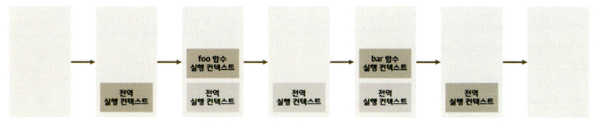

### ✏️ 동기 처리와 비동기 처리

1. 함수 호출 시 함수코드가 평가되어 함수 실행 컨텍스트 생성
2. 생성된 함수 실행 컨텍스트는 실행 컨텍스트 스택(=콜 스택)에 푸시되고 함수 코드 실행
3. 함수 코드의 실행이 종료하면 함수 실행 컨텍스트는 실행 컨텍스트 스택에서 팝(제거)된다.

```jsx
const foo = () => {};
const bar = () => {};
foo();
bar();
```


🪝**single thread** : 한 번에 하나의 태스크만 실행하는 방식

자바스크립트 엔진은 단 하나의 실행 컨텍스트 스택을 갖는데 이는 동시에 2개 이상의 함수를 실행할 수 없다는 것을 의미한다. “실행 중인 실행 컨텍스트”를 제외한 모든 실행 컨텍스트는 모두 실행 대기 중인 task들이다.

이처럼 자바스크립트 엔진은 한 번에 하나의 태스크만 실행할 수 있는 싱글 스레드 방식으로 동작한다. 싱글 스레드 방식은 처리에 시간이 걸리는 태스크를 실행하는 경우 블로킹(blocking, 작업 중단)이 발생한다.

현재 실행중인 태스크가 종료할 때까지 다음에 실행될 태스크가 대기하는 방식을 동기(synchronous)처리 라고 한다. 이 방식은 태스크를 순서대로 하나씩 처리하므로 실행 순서가 보장된다는 장점이 있지만, 앞선 태스크가 종료할 때까지 이후 태스크들이 블로킹되는 단점이 있다.

현재 실행 중인 태스크가 종료되지 않은 상태라 해도 다음 태스크를 곧바로 실행하는 방식을 비동기(asynchronous)처리라고 한다. 이 방식은 블로킹이 발생하지 않는다는 장점이 있지만 태스크의 실행 순서가 보장되지 않는 단점이 있다. 타이머 함수(`setTimeout`, `setInterval`), HTTP 요청, 이벤트 핸들러는 비동기 처리 방식으로 동작한다.

### ✏️ 이벤트 류프와 태스트 큐

자바스크립트는 싱글 스레드로 동작하여 한 번에 하나의 태스크만 처리할 수 있지만 브라우저가 동작하는 것을 보면 많은 태스크가 동시에 처리되는 것처럼 느껴지는데 이는 자바스크립트의 동시성을 지원하는 이벤트 루프(event loop) 때문이다.

- **콜스택: call Stack**
  소스코드 평가 과정에서 생성된 실행 컨텍스트가 추가되고 제거되는 스택 자료구조인 실행 컨텍스트 스택
  함수 호출 시 함수 실행 컨텍스트가 순차적으로 콜 스택에 푸시되어 순차적으로 실행
  최사위 실행 컨텍스트(실행중)가 종료되어 콜 스택에서 제거되기 전까지 다른 태스크는 실행되지 않는다.
- **힙: heap**
  객체가 저장되는 메모리 공간, 콜 스택의 요소인 시랭 컨텍스트는 힙에 저장된 객체를 참조
  할당해야 할 메모리 공간의 크기를 런타임에 결정(동적할당)해야 한다.

비동기 처리에서 소스코드의 평가와 실행을 제외한 모든 처리는 자바스크립트 엔진을 구동하는 환경인 브라우저나 Node.js가 담당하는데 이를 위해 브라우저 환겨은 태스크 큐와 이벤트 루프를 제공한다.

- **태스트 큐: task queue/event queue/callback queue**
  `setTimeout`, `setInterval` 같은 비동기 함수의 콜백 함수 또는 이벤트 핸들러가 일시적으로 보관되는 영역
- **이벤트 루프: event loop**
  콜 스택에 현재 실행 중인 실행 컨텍스트가 있는지, 태스크 큐에 대기 중인 함수가 있는지 반복 확인
  콜 스택이 비어있고 태스크 큐에 대기 중인 함수가 있다면 이벤트 루프는 순차적으로 태스크 큐에 대기 중잉 함수를 콜 스택으로 이동

자바스크립트는 싱글 스레드 방식으로 동작하는데 이때 싱글 스레드 방식으로 동작하는 것은 브라우저에 내장된 자바스크립트 엔진이다.(자바스크립트 엔진은 싱글 스레드로 동작하고 브라우저는 멀티 스레드로 동작한다.)
